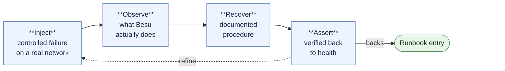
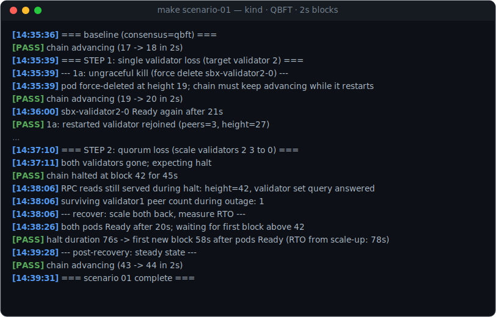

# Besu Chaos Engineering

[](https://github.com/jaravan/besu-chaos-engineering/actions/workflows/ci.yml)

Reproducible failure injection and verified recovery for permissioned
[Hyperledger Besu](https://besu.hyperledger.org/) networks on Kubernetes. Every
scenario is run against a real network before its runbook entry is written. It is
the operational companion to
[besu-sandbox](https://github.com/jaravan/besu-helmcharts).

## What this is

Most operational knowledge about running Besu consortium networks lives in
incident tickets and in the heads of the people who ran them. This repo makes it
public and reproducible: controlled failure injection against real permissioned
networks, the observed behaviour, and step-by-step recovery procedures.

Besu supports two Byzantine-fault-tolerant consensus mechanisms for permissioned
deployments, QBFT and IBFT 2.0. Some failure modes are consensus-agnostic (a node
loss, a bad genesis, a flooded txpool). Others depend on the protocol, such as how
a BFT set behaves when quorum is lost. Each scenario notes which consensus it
targets and, where it matters, how the behaviour differs across the two.

Each scenario follows the same loop, inject → observe → recover → assert, and
backs a runbook entry once its recovery procedure has actually been run and
verified. Every scenario runs against my own published Helm chart,
[besu-sandbox](https://github.com/jaravan/besu-helmcharts), installed straight
from its OCI registry.



## Requirements

The scenarios run against a **Kubernetes cluster**. They are pure `kubectl` under
the hood, so any cluster you can reach will do. [kind](https://kind.sigs.k8s.io/)
is the environment they were developed against and what the `make cluster-up` /
`cluster-down` helpers drive. Bring your own cluster and you can skip those targets.

- A [Kubernetes](https://kubernetes.io/) cluster. [kind](https://kind.sigs.k8s.io/) is used here; [minikube](https://minikube.sigs.k8s.io/) / [k3d](https://k3d.io/) / [k3s](https://k3s.io/) / any cluster works
- [kubectl](https://kubernetes.io/docs/reference/kubectl/) (>= 1.30), pointed at that cluster
- [Helm](https://helm.sh/) >= 3.8 (OCI support)
- [Docker](https://www.docker.com/) (for kind, or any cluster that needs it)

Local clusters work out of the box. Many scenarios need nothing beyond a working
cluster and outbound image pulls. Others need cluster _capabilities_ that a
locked-down managed cluster may not grant, which are properties of the cluster's
policy rather than of any one vendor:

- Privileged ephemeral containers. The network-partition and slow-peer
  scenarios attach a `NET_ADMIN` debug container (`kubectl debug --profile=sysadmin`) to shape traffic inside a node's network namespace (`iptables` DROP rules, `tc netem`). A cluster with restrictive PodSecurity admission will reject this.
- Public image egress. Scenarios pull `curlimages/curl`, and the traffic-shaping scenarios add `nicolaka/netshoot`. An air-gapped cluster needs these mirrored first.

## Quickstart

```sh
make cluster-up     # OPTIONAL — spins up a local kind cluster "besu-chaos"
                    # skip if you already have a cluster; just point kubectl at it
make install        # besu-sandbox from oci://ghcr.io/jaravan/besu-helmcharts
make scenario-01    # validator loss (STEP=1 single / STEP=2 quorum / both)
make cluster-down   # tear down the kind cluster (no-op if you brought your own)
```

## Sample run

An unedited excerpt from a real `make scenario-01` run (kind, chart 0.3.3,
Besu 26.6.1, QBFT, 2s blocks): one validator lost while the network stays healthy,
then two, with a verified halt and a measured recovery.



<details>
<summary>Plain-text log</summary>

```text
[14:35:36] === baseline (consensus=qbft) ===
[PASS] chain advancing (17 -> 18 in 2s)
[14:35:39] === STEP 1: single validator loss (target validator 2) ===
[14:35:39] --- 1a: ungraceful kill (force delete sbx-validator2-0) ---
[14:35:39] pod force-deleted at height 19; chain must keep advancing while it restarts
[PASS] chain advancing (19 -> 20 in 2s)
[14:36:00] sbx-validator2-0 Ready again after 21s
[PASS] 1a: restarted validator rejoined (peers=3, height=27)
...
[14:37:10] === STEP 2: quorum loss (scale validators 2 3 to 0) ===
[14:37:11] both validators gone; expecting halt
[PASS] chain halted at block 42 for 45s
[14:38:06] RPC reads still served during halt: height=42, validator set query answered
[14:38:06] surviving validator1 peer count during outage: 1
[14:38:06] --- recover: scale both back, measure RTO ---
[14:38:26] both pods Ready after 20s; waiting for first block above 42
[PASS] halt duration 76s -> first new block 58s after pods Ready (RTO from scale-up: 78s)
[14:39:28] --- post-recovery: steady state ---
[PASS] chain advancing (43 -> 44 in 2s)
[14:39:31] === scenario 01 complete ===
```

</details>

Two lines carry the finding. The chain halts the moment quorum is lost, while
every pod stays `Ready` and RPC keeps answering. Recovery is measured, not
assumed (`RTO from scale-up: 78s`).

## Scenarios

Each scenario lives in its own directory under [scenarios/](scenarios/) with a
`README.md` (hypothesis, method, expected and observed behaviour) and a `run.sh`
that executes the full inject → observe → recover → assert cycle. Scenario numbers
are stable IDs wired into the Makefile and the runbook.

> **Cross-cutting note: cold-start peering.** On chart ≤ 0.2.2 a fresh
> simultaneous deploy could leave the validators in a sparse hub-and-spoke mesh
> (`net_peerCount` `3/1/1/1`) even though every pod is `Running`/`Ready` and blocks
> are flowing. This was a Kubernetes/P2P startup-timing artifact, independent of
> QBFT vs IBFT 2.0, and is fixed in chart 0.2.3 (`publishNotReadyAddresses` on the
> validator Services): fresh installs now cold-start to a full `3/3/3/3` mesh.

### Consensus & availability

How a BFT validator set behaves as validators are lost, isolated, degraded, or
deliberately reconfigured.

| #                                        | Scenario                | Failure injected                                                                                                   | Consensus       |
| ---------------------------------------- | ----------------------- | ------------------------------------------------------------------------------------------------------------------ | --------------- |
| [01](scenarios/01-validator-loss/)       | Validator loss          | One validator down (network healthy), then two — quorum broken, verified halt, measured RTO                        | QBFT · IBFT 2.0 |
| [02](scenarios/02-network-partition/)    | Network partition       | iptables split `[1,2] \| [3,4]`: neither side has quorum, both halt at the same block, every pod still Ready       | QBFT · IBFT 2.0 |
| [03](scenarios/03-slow-peer/)            | Slow peer               | `tc netem` degrades one validator past the round-change timeout — silent loss of all fault tolerance               | QBFT · IBFT 2.0 |
| [04](scenarios/04-validator-governance/) | Validator governance    | Vote a member out of the validator set and back in at runtime — no restart, no genesis change                      | QBFT · IBFT 2.0 |
| [05](scenarios/05-duplicate-validator/)  | Duplicate validator key | A second node runs the same validator key (HA gone wrong): the copy never joins consensus — with documented limits | QBFT · IBFT 2.0 |

The **QBFT · IBFT 2.0** tag means each scenario was run and verified on both
engines; the measured per-engine numbers are in
[01](scenarios/01-validator-loss/README.md#conclusion) ·
[02](scenarios/02-network-partition/README.md#observed) ·
[03](scenarios/03-slow-peer/README.md#observed) ·
[04](scenarios/04-validator-governance/README.md#observed) ·
[05](scenarios/05-duplicate-validator/README.md#observed).

### Transaction layer

What gates, strands, or rejects a transaction while consensus stays healthy. These
scenarios are engine-agnostic: they exercise the transaction pipeline, not the
validator set.

| #                                         | Scenario                  | Failure injected                                                                                                   | Consensus      |
| ----------------------------------------- | ------------------------- | ------------------------------------------------------------------------------------------------------------------ | -------------- |
| [06](scenarios/06-txpool-flooding/)       | Transaction pool flooding | Saturate a sender's future-nonce queue until Besu rejects (`-32000`), then fill the gap and watch the queue mine   | Any (tx-layer) |
| [07](scenarios/07-account-permissioning/) | Account permissioning     | A funded but not-allowlisted sender is denied at submission (`-32007`); allowlisting via `perm_*` RPC lets it mine | Any (tx-layer) |
| [08](scenarios/08-permissioning-outage/)  | Permissioning outage      | Empty the allowlist: every sender denied while empty blocks keep flowing — network "up", frozen for users          | Any (tx-layer) |

### State & storage

Whether a node can be rebuilt from what is on disk, and which backups deserve the
trust. These scenarios operate on one node's data volume; consensus stays healthy
throughout (the target is beyond quorum).

| #                                    | Scenario         | Failure injected                                                                                                            | Consensus           |
| ------------------------------------ | ---------------- | --------------------------------------------------------------------------------------------------------------------------- | ------------------- |
| [09](scenarios/09-snapshot-restore/) | Snapshot restore | Restore a validator from cold, hot-idle, and hot-under-load snapshots; a failed hot restore auto-recovers via wipe + resync | Any (storage-layer) |

### Configuration & onboarding

What keeps a correctly-running node from ever joining the network. In a consortium
each member deploys their own node, so configuration drifts, and the gate sits
below consensus at the devp2p/eth handshake.

| #                                        | Scenario               | Failure injected                                                                                        | Consensus             |
| ---------------------------------------- | ---------------------- | ------------------------------------------------------------------------------------------------------- | --------------------- |
| [10](scenarios/10-genesis-config-drift/) | Genesis / config drift | A joiner with a drifted genesis is rejected at the eth handshake — stuck at block 0, network unaffected | Any (handshake layer) |

## Runbook

[runbook/](runbook/) holds incident entries in a fixed format: symptom, likely
causes, diagnosis steps, recovery procedure, prevention. An entry is added only
after the corresponding scenario has been run and its recovery procedure verified,
so the runbook stays grounded in observed behaviour rather than theory.

| Entry                                                                                                 | Backed by scenario                             |
| ----------------------------------------------------------------------------------------------------- | ---------------------------------------------- |
| [Validator down, network healthy](runbook/01-validator-down-network-healthy.md)                       | [01](scenarios/01-validator-loss/) (Step 1)    |
| [Chain halted, quorum loss](runbook/02-chain-halted-quorum-loss.md)                                   | [01](scenarios/01-validator-loss/) (Steps 2–4) |
| [Chain halted, network partition](runbook/03-chain-halted-network-partition.md)                       | [02](scenarios/02-network-partition/)          |
| [Erratic block times, slow validator](runbook/04-erratic-block-times-slow-validator.md)               | [03](scenarios/03-slow-peer/)                  |
| [Changing the validator set](runbook/05-validator-set-governance.md)                                  | [04](scenarios/04-validator-governance/)       |
| [Transactions rejected or stuck pending](runbook/06-transactions-rejected-or-stuck-pending.md)        | [06](scenarios/06-txpool-flooding/)            |
| [Account not authorized to send](runbook/07-account-not-authorized-to-send.md)                        | [07](scenarios/07-account-permissioning/)      |
| [Network "up" but no transactions](runbook/08-network-up-but-no-transactions.md)                      | [08](scenarios/08-permissioning-outage/)       |
| [Restoring a node from a volume snapshot](runbook/09-node-restore-from-volume-snapshot.md)            | [09](scenarios/09-snapshot-restore/)           |
| [New/member node won't sync (genesis mismatch)](runbook/10-member-node-wont-sync-genesis-mismatch.md) | [10](scenarios/10-genesis-config-drift/)       |

## Safety

These scenarios inject real failures and are intended only for disposable test
networks. As a guardrail the scripts refuse to run unless the current kubectl
context looks like a local/disposable cluster: `kind-*`, `minikube`, `k3d-*`,
`k3s`, or `docker-desktop`. Any other context (including a managed cluster)
requires `ALLOW_ANY_CONTEXT=1` to run, at your own risk.

> `ALLOW_ANY_CONTEXT` is not a Kubernetes or Helm setting. It is an escape hatch
> defined by this repo's own guard (`guard_local_context` in
> [`scripts/lib.sh`](scripts/lib.sh)), which aborts the run if your current
> context is not one of the recognised local prefixes above. Set it only when you
> have deliberately pointed kubectl at a cluster you are certain is safe to break,
> and pass it per-invocation so it never lingers: `ALLOW_ANY_CONTEXT=1 make scenario-01`.

## License

Copyright 2026 John Aravanis. Licensed under the Apache License, Version 2.0.
See [LICENSE](LICENSE) and [NOTICE](NOTICE).
