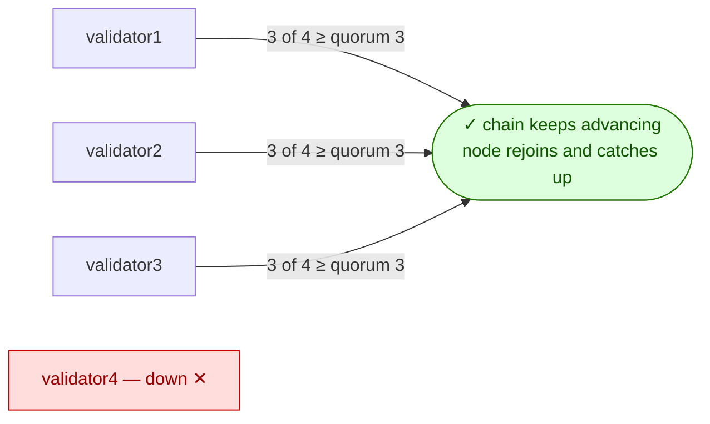
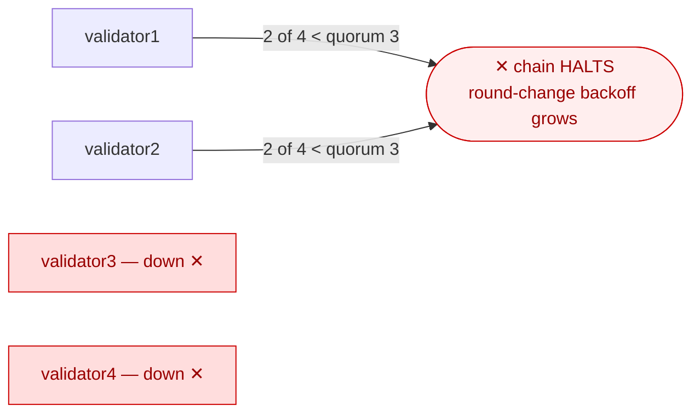

# Scenario 01 — Validator Loss

One scenario, four steps. The first two move along a single axis — how a
4-validator BFT set behaves as validators are lost, first **below** the fault
threshold (safe) and then **above** it (a halt). The last two turn to recovery:
once a halt has dragged on and the round-change timer has backed off, can a
**coordinated restart of all validators** reset that backoff and resume block
production immediately (Step 3) — and how much of the set must actually be
restarted to get there (Step 4)?

With N=4, both of Besu's BFT engines tolerate `f = floor((N-1)/3) = 1` faulty
validators and need quorum `2f+1 = 3` to commit a block. Step 1 stays inside that
budget (one down); Step 2 exceeds it (two down). The contrast is the whole point —
the same cluster, one validator either side of the line, produces "nothing
happened" versus "the chain stops."

**Consensus:** run against both **QBFT** and **IBFT 2.0**. The fault model is
identical and the measured behaviour is near-identical (see the
[comparison](#consensus-comparison) below). Select the engine with `CONSENSUS`
(it must match the deployed release):

```sh
make install  CONSENSUS=ibft2     # deploy IBFT 2.0 (default: qbft)
make scenario-01 CONSENSUS=ibft2  # run the scenario against it
```

Run the default steps (1 + 2), or pick one:

```sh
make scenario-01            # steps 1 + 2
STEP=1 make scenario-01     # single validator loss only
STEP=2 make scenario-01     # quorum loss only
STEP=3 HALT_WINDOW=300 make scenario-01                    # coordinated restart (opt-in)
STEP=4 STUCK_SURVIVORS=1 HALT_WINDOW=300 make scenario-01  # partial restart / f+1 threshold (opt-in)
```

---

## Step 1 — Single validator loss (network healthy)



### Hypothesis

Losing one validator must not interrupt block production. A killed validator
should rejoin cleanly and catch up to head without manual intervention.

### Method

Two injections against the besu-sandbox network (validator 2 by default —
override with `TARGET_VALIDATOR`):

- **1a — ungraceful kill.** `kubectl delete pod sbx-validator2-0
--grace-period=0 --force` (SIGKILL semantics, no graceful shutdown). The
  StatefulSet recreates the pod immediately, exercising crash + automatic
  restart + rejoin.
- **1b — sustained outage.** Scale the `sbx-validator2` StatefulSet to 0, hold
  for `OUTAGE_WINDOW` (default 30s), then scale back to 1 — prolonged N-1
  operation and catch-up after recovery.

### Expected

- Block production continues throughout both injections (sampled via
  `eth_blockNumber` against the unified RPC service).
- During 1b, surviving validators drop to 2 validator peers each.
- After recovery the restarted validator reports ≥ 3 peers and is within a few
  blocks of head.
- What may mislead: RPC clients pinned to the dead validator see connection
  errors — alerting keyed on RPC errors alone fires even though the network is
  healthy.

### Observed

Both engines behaved as hypothesised — block production never paused while one
validator was down, and the validator rejoined at head with no manual
intervention. Recorded on kind v0.32.0 (macOS/arm64, kubectl 1.36.1,
Besu 26.6.0, 2s block period).

**QBFT** (chart 0.2.2):

- **1a (force delete):** chain kept advancing during the restart with no
  observable pause at the 2s sampling resolution (kill at height 5; next block
  5 → 6 within 2s). Pod back to Ready in **20s**; on rejoin it reported 3 peers
  and was already at head (height 13).
- **1b (30s sustained outage):** block production continued uninterrupted at
  3-of-4. After scaling back, the validator was at head with **catch-up gap 0**
  by the time it reported Ready + 10s (node=head=30).
- **Transient peer-count asymmetry:** at baseline (~67s after install),
  validator1 reported 3 peers while validators 2, 3 and 4 reported 1 — all four
  Ready and at the same height (5); consensus was unaffected. By the end of the
  run peering had climbed toward full mesh (validators 1 and 4 at 3 peers, 2 and
  3 at 2).

**IBFT 2.0** (chart 0.2.2):

- **1a (force delete):** chain kept advancing, but the next block after the kill
  took ~10s rather than the single 2s block period — consistent with a proposer
  round-change when the killed node held the proposer slot. Pod back to Ready in
  **21s**; on rejoin it reported 3 peers at height 36.
- **1b (30s sustained outage):** uninterrupted at 3-of-4; after scaling back the
  validator was at head with **catch-up gap 0** (node=head=56).
- **Peering reached full mesh quickly** — all four validators at 3 peers at
  baseline.
- **Cold start:** IBFT 2.0 took ~70s after genesis to produce its first block
  (block 1 committed at round 3 = 10+20+40s of round-change backoff while peering
  settled); QBFT began producing immediately. `make install --wait` returns on
  pod-readiness, which for IBFT 2.0 precedes first-block production — wait for the
  chain to actually advance, not just for pods `Ready`.

Either way the operational takeaway is the same: **full-mesh peering lags node
readiness, so monitoring that alerts on peer count immediately after a
deploy/restart will false-positive.**

---

## Step 2 — Quorum loss (chain halts)



### Hypothesis

Taking down two validators simultaneously must halt block production at the last
committed block — immediate finality means no forks and no rollback, just a stop.
RPC reads should keep working on the surviving nodes, and the network should
recover **without manual intervention** once quorum is restored.

The number that matters is the **RTO**: how long after the failed validators
return does the first new block appear? The BFT round-change timeout (QBFT and
IBFT 2.0 alike) doubles on every failed round — with this chart's
`requesttimeoutseconds: 10` that is 10 → 20 → 40 → 80 … seconds — so the surviving
validators climb to higher rounds for as long as the outage lasts. Recovery is
_not_ instant, and the longer the halt, the longer the wait for the round timers
to resynchronise.

### Method

Scale validators 2 and 3 (override with `TARGET_VALIDATORS="2 3"`) to 0
replicas, hold the outage for `HALT_WINDOW` (default 45s), then scale both back
and measure time to the first new block.

Assertions: chain advancing at baseline → height frozen for the full halt window
(sampled every 2s, RPC must keep answering) → first block above the halt height
within 900s of recovery → steady state restored on all four validators.

### Expected

- Chain halts at the last committed height; no forks, no divergent heights
  between surviving validators.
- `eth_blockNumber` and the validator-set query
  (`qbft_getValidatorsByBlockNumber`, or `ibft_getValidatorsByBlockNumber` under
  IBFT 2.0) keep answering
  during the halt — **chain halted ≠ RPC down**, which matters for both
  monitoring (block-height-stalled is the signal, not RPC errors) and read-only
  workloads that keep functioning.
- Recovery is automatic but not immediate: expect tens of seconds beyond pod
  readiness for round-change resynchronisation after a 45s halt; expect worse
  after longer halts.

### Observed

Both engines behaved identically in kind: the chain froze at the last committed
block for the full halt window — every 2s sample identical, no forks, surviving
validators at the same height — while `eth_blockNumber` and the validator-set
query kept answering and validator1 dropped to 1 peer. Pods stayed Running/Ready
throughout: to Kubernetes the outage was invisible. Recovery was fully automatic
in every run — no stuck round-change loop, no manual intervention, no divergent
heights afterwards.

**RTO grows with halt duration — superlinearly, and near-identically for both
engines.** One run per cell (kind v0.32.0 on macOS/arm64, kubectl
1.36.1, chart 0.2.2, Besu 26.6.0, 2s block period, `requesttimeoutseconds` 10).
These absolute seconds are **environment-specific** — single-node kind with serial
pod restarts; on a multi-node cluster with anti-affinity (parallel restarts) they
shift. What transfers is the _shape_ — the superlinear curve here, and the f+1
threshold in [Step 4](#step-4) — not the exact seconds. Reproduce any cell with
`HALT_WINDOW=<window> STEP=2 make scenario-01 CONSENSUS=<engine>`. All values are
in seconds:

| `HALT_WINDOW` | Engine   | Halt duration | First block after Ready | RTO |
| ------------- | -------- | ------------- | ----------------------- | --- |
| 45s           | QBFT     | 71            | 60                      | 81  |
| 45s           | IBFT 2.0 | 72            | 62                      | 83  |
| 120s          | QBFT     | 154           | 134                     | 154 |
| 120s          | IBFT 2.0 | 151           | 136                     | 157 |
| 300s          | QBFT     | 341           | 588                     | 609 |
| 300s          | IBFT 2.0 | 342           | 584                     | 605 |

Those three measured columns start _and_ stop at **different moments** — crucially,
halt duration ends at "pods Ready" while RTO ends much later, at the first
produced block. That is why RTO can exceed halt duration. Mapped onto one
timeline:

```
│ both validators scaled to 0 → quorum lost, block production halts
│                                            ┐
│   ... validators absent for ~HALT_WINDOW ...│  halt duration
│                                             │  (inject → pods Ready)
├─ scale-up issued              ┐             │
│   ~20s: pods recreate & resync│ RTO         │
├─ both pods report Ready       │ (scale-up   ┘   ┐
│                               │  → first        │ first block
│   round-change backoff being  │  block)         │ after Ready
│   waited out (can be minutes) │                 │ (pods Ready
└─ first block produced         ┘                 ┘  → first block)
```

- **`HALT_WINDOW`** — the input knob: how long the scenario keeps the validators
  scaled to 0 before scaling them back up. Everything else is measured.
- **Halt duration** — injection → both pods Ready (`ready_t - inject_t0`). Roughly
  `HALT_WINDOW` + pod-restart overhead. **It stops counting the moment Kubernetes
  reports the validators Ready** — so it does _not_ include the round-change
  backoff that follows, and is _not_ the full time blocks were stopped.
- **First block after Ready** — pods Ready → first new block. The round-change
  backoff still being waited out _after_ Kubernetes already reports everything
  healthy. This whole stretch falls outside halt duration.
- **RTO** — scale-up → first block: total operator-felt recovery. Equals **first
  block after Ready + the pod-restart gap** (scale-up → Ready, a steady ~20s here,
  e.g. 588 + 21 = 609 at `HALT_WINDOW=300s`).

**Why RTO > halt duration.** The two don't share an end point. Halt duration
stops at pods-Ready; RTO keeps running through the entire round-change backoff,
which happens after pods are Ready. When that backoff tail is large (588s at the
300s window) RTO (609) dwarfs halt duration (341); when it's small (45s window)
the two are close (81 vs 71). The true end-to-end "blocks weren't moving" time is
**halt duration + first block after Ready** (they meet at pods-Ready) — ~929s at
the 300s window.

The mechanism is BFT round-change backoff (the same in QBFT and IBFT 2.0):
throughout the halt the two surviving validators keep proposing, failing, and
doubling their round timeout (`requesttimeoutseconds` 10s → 20s → 40s → 80s → …),
so the longer the outage, the higher the round — and recovery has to wait out the
current round's inflated timer (plus any further failed rounds while the restored
validators resync) before the set agrees on a block. A ~5.5-minute outage cost
nearly **10 minutes** of additional downtime after all pods were Ready. Block
production resuming minutes after Kubernetes reports everything healthy is normal,
not a hang.

**Observing the climbing timer.** The current round and its inflated timeout are
not exposed by any RPC or Prometheus metric — the only source is the validator's
`RoundTimer` log line, which states both: `Moved to round 2 which will expire in
40 seconds`. Equivalently it is `requesttimeoutseconds × 2^round`. Read it from a
node that stayed up through the halt — a restart discards the log
(`kubectl -n besu logs sbx-validator1-0 | grep -iE 'RoundTimer|expire in'`).

Restarting **individual** "stuck" nodes during this window only makes the outage
longer: the restarted node drops to round 0 while its peers sit on a high round,
deepening the round mismatch. A **coordinated restart of all validators at once**
is a different lever entirely — it resets the whole set's in-memory round state
together, so the backoff is cleared rather than deepened. [Step 3](#step-3)
isolates and measures exactly that.

<a id="consensus-comparison"></a>

**Consensus comparison.** Under validator loss, QBFT and IBFT 2.0 are
behaviourally near-indistinguishable: same fault threshold, same
halt-on-quorum-loss, same superlinear RTO curve (every cell within a few seconds
of its counterpart). The only differences observed were at startup — IBFT 2.0's
slower cold-start and its ~10s post-kill block in Step 1 (proposer round-change) —
neither of which affects the quorum-loss RTO. Both engines were measured on the
same chart (0.2.2) and cluster.

---

<a id="step-3"></a>

## Step 3 — Coordinated restart resets round-change backoff

Step 2 showed that recovery from a halt is automatic but slow: the surviving
validators have backed off to a high round, and the set must wait the inflated
round timer out before the first block (588s after a 300s halt). That wait is the
_automatic_ path. This step tests the _operator_ path — deliberately resetting the
backoff with a coordinated restart — and measures how much of that tail it removes.

### Hypothesis

The round number and its doubling timeout are **in-memory** consensus state; only
the blockchain itself is persisted. So:

- Restarting a validator's **process** (not its data) drops it back to round 0
  with the base `requesttimeoutseconds`. The PVC is untouched, so the node reloads
  the last committed block — this is a restart, **not** a resync.
- A **coordinated restart of all four validators together** (the recovered pair
  _and_ the two survivors) resets the whole set to round 0 at once, so the first
  block follows within roughly the base timeout — far below the Step 2 backoff
  tail at the same halt depth.
- The survivors are the ones holding the inflated round, so they **must** be
  restarted too; bringing back only the downed pair (the Step 2 control) leaves
  the survivors on a high round and the long wait intact.
- Restarting only a **subset**, or staggering the restarts, is expected to be
  _worse_ than waiting — restarted nodes drop to round 0 while peers stay high,
  deepening the mismatch (the cautionary case in Step 2).
- No fork, no rollback, no divergent heights: immediate finality means the last
  committed block is final, and every node restarts from it.

### Method

Reuse the Step 2 quorum-loss injection (scale `TARGET_VALIDATORS="2 3"` to 0) and
hold for `HALT_WINDOW=300s` — the deepest point Step 2 measured, where waiting it
out costs ~588s. Then, instead of waiting:

1. Scale the downed pair back to 1, **and** in parallel `kubectl delete pod` the
   two survivors (process restart, PVC retained) — all four re-enter consensus at
   round 0 close to simultaneously.
2. Wait for all four pods Ready, then measure time to the first block above the
   halt height.

```sh
STEP=3 HALT_WINDOW=300 make scenario-01 CONSENSUS=<engine>
```

The headline number is **first-block-after-Ready for the coordinated restart vs.
the Step 2 control (588 / 584s)** at the same `HALT_WINDOW`.

### Expected

- First block within roughly the base round timeout plus pod-restart churn (tens
  of seconds), **not** the ~588s control. Because a pod restart (~20s) is longer
  than the 10s base round-0 timer, expect a little churn — the set likely re-forms
  at round ~1–2, not a clean round 0 — but nowhere near the pre-restart round.
- All four validators converge on the same height; no forks, no divergence.
- The previously-down nodes catch up to head within a few blocks.

### Observed

**The coordinated restart cleared almost the entire backoff tail on both engines.**
One run each (kind v0.32.0 on macOS/arm64, kubectl 1.36.1, chart
0.2.2, Besu 26.6.0, 2s block period, `requesttimeoutseconds` 10), `HALT_WINDOW=300s`,
validators 2 + 3 downed, survivors 1 + 4 restarted alongside the recovered pair.
Control column is the Step 2 "wait it out" result at the same halt depth:

| Engine   | First block after Ready | RTO from restart | First recovered block | Step 2 control (after Ready / RTO) |
| -------- | ----------------------- | ---------------- | --------------------- | ---------------------------------- |
| QBFT     | **6s**                  | **77s**          | Round 1               | 588s / 609s                        |
| IBFT 2.0 | **22s**                 | **84s**          | Round 2               | 584s / 605s                        |

- **The backoff reset works as hypothesised.** After a 300s halt the survivors had
  backed off to roughly round 5 (cumulative `10+20+40+80+160`s — directly observed
  in [Step 4](#step-4), where the un-restarted survivor's logs show the climb to
  round 5; here the survivors were restarted, so it is inferred from the math).
  After the coordinated restart the **first recovered block committed at round 1
  (QBFT) /
  round 2 (IBFT 2.0)** on all four validators — confirmed from the validators'
  round logs. The inflated timer was gone; the set re-formed near round 0. The
  ~1–2 rounds of churn match the prediction: pod restart takes longer than the 10s
  base round-0 timer, so a couple of rounds elapse before quorum re-forms.
- **First-block-after-Ready collapsed from ~588s to 6s/22s** — the restart removes
  ~96–99% of the backoff tail. This is the headline: at this halt depth, waiting it
  out costs ~10 minutes; the coordinated restart costs seconds.
- **RTO is now dominated by pod startup, not consensus.** RTO from restart was
  77s (QBFT) / 84s (IBFT 2.0), of which the **pod-restart gap was 71s / 62s** — far
  more than Step 2's ~20s two-pod recovery. Cause: all four pods restart together
  _and_ validators 2–4 gate their startup on validator1's liveness init-container,
  which is itself a restarted survivor — so bringup serialises behind validator1.
  The consensus part of recovery (first block after Ready) is only 6–22s; the rest
  is Kubernetes bringing pods back. Budget ~1 minute of pod churn for a full-set
  restart, not instant recovery.
- **No fork, no divergence.** All four validators converged on the same height and
  resumed steady 2s block production immediately (QBFT 132 across the set,
  IBFT 2.0 13 across the set); the previously-down pair caught up within a few
  blocks.
- **Engine difference is minor and in the expected direction.** IBFT 2.0 re-formed
  one round later and took ~16s longer to the first block (round 2 / 22s vs round
  1 / 6s) — consistent with its slightly slower proposer/round-change startup noted
  in Step 1, not a different recovery behaviour.

**Bottom line.** For a halt deep enough that the residual round timer dominates
(here ~10 minutes of tail after a 5-minute outage), a coordinated restart of _all_
validators turns a ~10-minute automatic recovery into a ~1-minute operator action,
almost all of which is pod startup. The lever is real and engine-independent.

> **Negative control →** [Step 4](#step-4) isolates _how much_ coordination is
> actually required by leaving some survivors stuck at their high round — proving
> the active ingredient is reaching quorum at a low round, not the restart itself.

This verifies the remedy documented in runbook
[02](../../runbook/02-chain-halted-quorum-loss.md): for a chain halted long enough
that recovery is dragging, a **coordinated restart of all validators** (process
restart, data volumes retained) resets the round-change backoff and restores block
production in about the time it takes the pods to come back.

---

<a id="step-4"></a>

## Step 4 — How many validators must be restarted (the f+1 threshold)

Step 3 restarted _all_ validators and recovered fast. But does recovery really need
the whole set, or just enough of it? This step leaves some survivors at their high
round on purpose and finds the boundary.

### Hypothesis

Recovery is fast as soon as **2f+1 validators sit at a low round together** — that
is quorum, and quorum can commit regardless of what the rest are doing. Crucially,
**round timers are per-node, not global**: the fresh nodes run on their own reset
(base) timers and do **not** wait out the stuck node's inflated timer — they reach
quorum among themselves and commit. The failure mode is symmetric: a node
fast-forwards to a higher round only when it sees **f+1** round-change messages for
it. So with N=4 (f=1, quorum=3):

- The downed pair always returns **fresh at round 0** (2 nodes). Restart **one**
  survivor too → **3 fresh nodes = quorum at a low round** → expect fast recovery,
  like Step 3. The single remaining stuck survivor is only 1 round-change message,
  **below f+1 = 2**, so it cannot drag the quorum up.
- Restart **no** survivors → only the 2 fresh downed nodes, **below quorum**, and
  the **2 stuck survivors are exactly f+1** → they fast-forward the fresh pair up to
  the high round → the wait persists. (This is the Step 2 control, ~588s.)

In short: **the wait persists if and only if ≥ f+1 validators remain stuck at the high round.**
You may leave up to _f_ survivors un-restarted and still recover fast. "Restart at
least one survivor" — not "restart everyone" — is the operative rule for N=4.

### Method

Same injection and `HALT_WINDOW=300s` as Step 3, but leave `STUCK_SURVIVORS` of the
survivors running at their high round (don't restart them):

```sh
STEP=4 STUCK_SURVIVORS=1 HALT_WINDOW=300 make scenario-01 CONSENSUS=<engine>  # 1 stuck → expect fast
STEP=4 STUCK_SURVIVORS=2 HALT_WINDOW=300 make scenario-01 CONSENSUS=<engine>  # 2 stuck → expect the full wait
```

### Expected

- `STUCK_SURVIVORS=1`: first block within seconds-to-tens-of-seconds of pods Ready
  (comparable to Step 3), committed at a low round — confirming one stuck survivor
  is tolerated.
- `STUCK_SURVIVORS=2`: first block only after the full backoff tail (~588s),
  matching the Step 2 control — confirming f+1 stuck validators force the wait.

### Observed

**One stuck survivor is tolerated — recovery is fast and at a low round, exactly as
the f+1 rule predicts, and identically on both engines.** `STUCK_SURVIVORS=1`,
`HALT_WINDOW=300s` (same cluster/build as Step 3): validators 2 + 3
downed, validator 4 restarted, **validator1 left stuck** at its high round.

- **First block 2s after pods Ready, RTO 23s from the restart — identical on QBFT
  and IBFT 2.0** — committed at **Round 1** on validators 2, 3, 4. The three fresh
  nodes formed quorum at a low round and ignored validator1's lone high-round
  round-change (1 message, below the **f+1 = 2** needed to fast-forward the set).
  The ~588s backoff tail was skipped.
- **The fresh quorum did not wait for the stuck node's timer.** Validator1 sat on a
  320s round-5 timer, yet the first block came in **2s** — they ran on their own
  reset timers, not its inflated one. That 2s « 320s gap _is_ the proof: the
  quorum committed among themselves and validator1 caught up afterwards by syncing.
- **Direct evidence of the stuck node.** Because validator1 was _not_ restarted, its
  logs survive and show the climb during the halt — the same on both engines:
  `Moved to round 2 (40s) → 3 (80s) → 4 (160s) → 5 (320s)`. It sat at round 5 with a
  320s timer while the other three recovered around it.
- **Faster than the full restart (Step 3: 6s/22s, RTO 77s/84s).** Leaving validator1
  up meant only three pods restarted _and_ none had to wait on validator1's liveness
  init-container — so the pod-restart gap was 21s, not ~62–71s. **Not restarting the
  bootnode/liveness-gate survivor is both sufficient and faster.**

| `STUCK_SURVIVORS` | Nodes fresh at low round | QBFT             | IBFT 2.0         | First recovered block |
| ----------------- | ------------------------ | ---------------- | ---------------- | --------------------- |
| 0 (= Step 3)      | 4 (all)                  | RTO 77s          | RTO 84s          | Round 1 / Round 2     |
| 1                 | 3 (quorum)               | **2s / RTO 23s** | **2s / RTO 23s** | Round 1 / Round 1     |
| 2 (= Step 2 ctrl) | 2 (below quorum)         | ~588s            | ~584s            | high round            |

The `STUCK_SURVIVORS=2` row is the Step 2 control (restart no survivors = bring the
downed pair back only); it was not re-run here, as it is identical to that
measurement. The threshold is confirmed on both engines: **the wait persists if and only if
≥ f+1 = 2 validators remain stuck.** Up to f = 1 survivor may be left un-restarted.

**Operational takeaway.** "Restart the whole set" is the simple safe rule, but the
minimum that works is "get 2f+1 validators to a fresh low round." For N=4 that means
restarting the recovered pair plus **at least one** survivor — and _skipping_ the
liveness-gate node (validator1) makes recovery faster, not slower.

---

## Conclusion

For the failures this scenario exercises — single-validator loss and quorum loss
— **QBFT and IBFT 2.0 are interchangeable** (see the comparison above): identical
fault threshold, identical halt-on-quorum-loss, and the same RTO curve within
run-to-run noise, differing only in startup/proposer timing.

That equivalence is **scoped to availability and fault tolerance** — it should not
be read as a blanket "QBFT ≈ IBFT 2.0." The real, designed differences between the
two don't surface under validator loss:

- **Validator-set management.** QBFT supports both vote/header-based and
  smart-contract-based validator management; IBFT 2.0 is vote/header only. That's
  the biggest functional gap, and it does not surface under validator loss — it
  takes exercising validator governance to see it.
- **Proposer-selection policy and message format.** QBFT is the newer engine,
  positioned as the recommended one going forward, with a more extensible message
  structure.

To actually distinguish the two engines, exercise validator governance — not
validator loss.

---

## Variations

- **Kill the bootnode (`TARGET_VALIDATOR=1`).** Validators 2–4 gate their
  _startup_ on validator1's liveness endpoint (init container), so a running
  network should tolerate the loss — but pod restarts elsewhere during the
  outage will block. Worth a dedicated run.
- **Longer halts** (`HALT_WINDOW=600` and up) — extend the RTO curve beyond the
  measured 45/120/300 points; at some round the residual timer dominates. The
  "wait vs. restart-all-validators-together" half of that question is now
  [Step 3](#step-3).
- **Ungraceful double kill** — force-delete both pods in Step 2 instead of
  scaling, then let the StatefulSets restart them; checks crash-recovery under
  quorum loss rather than clean shutdown.

## Runbook entries backed by this scenario

- [Validator down, network healthy (false-positive alert
  storm)](../../runbook/01-validator-down-network-healthy.md) — Step 1.
- [Chain halted, all pods Running/Ready (quorum
  loss)](../../runbook/02-chain-halted-quorum-loss.md) — Step 2, the
  highest-stakes false-comfort state in Kubernetes: nothing is CrashLooping, yet
  the network is down. Steps 3 and 4 add the verified recovery levers (coordinated
  restart, and the f+1 minimum) to that entry's recovery procedure.
