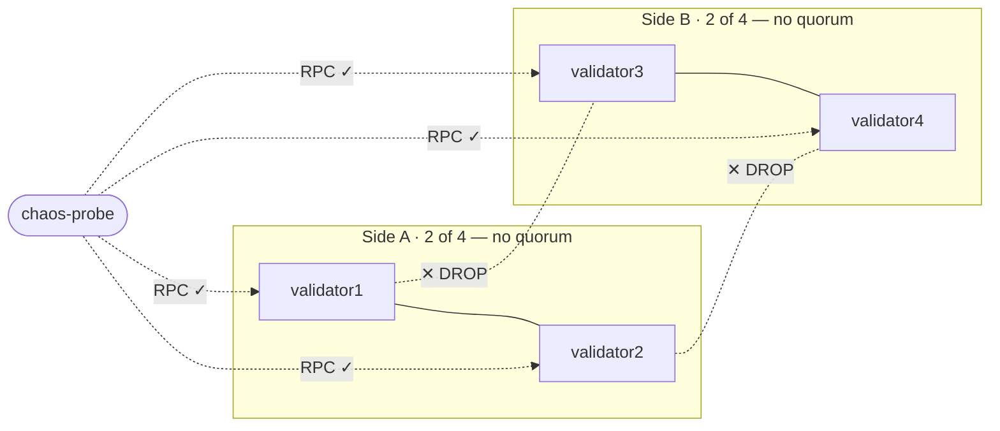

# Scenario 02 — Network Partition (split-brain)

## Hypothesis

Split the four validators into two pairs, `[validator1, validator2]` and
`[validator3, validator4]`, that cannot reach each other, while the probe can
still reach every node's RPC. Each side now sees only 2 of 4 validators, below the
BFT quorum of 2f+1 = 3.

The name "split-brain" is borrowed from databases, where a partition can let two
sides accept conflicting writes and diverge. Besu's BFT engines cannot split-brain.
Block commitment requires a 2f+1 quorum, and both QBFT and IBFT 2.0 have immediate
finality, so neither 2-validator side can commit a block. The outcome is therefore
the same as quorum loss
([scenario 01, Step 2](../01-validator-loss/README.md#step-2--quorum-loss-chain-halts)):
both sides halt at the last committed block, with no fork, no divergent heights, and
nothing to reconcile when the partition heals.

What makes this distinct from quorum loss, and worse for an operator: in a partition
all four pods stay `Running`/`Ready`. Quorum loss at least had two pods missing;
here Kubernetes sees a fully healthy deployment while the network is dead. It is the
strongest case for "alert on block-height-stall, not on pod health."



_Each side keeps its own pair but loses the other. 2 of 4 is below quorum, so both
sides halt at the same block (no fork). RPC reaches every node throughout._

## Method

Inject the partition with `iptables` `DROP` rules in the validator pods' network
namespaces. The Besu containers have neither `iptables` nor `NET_ADMIN`, so the
rules are added via privileged ephemeral debug containers
(`kubectl debug --profile=sysadmin`, image `nicolaka/netshoot`) that share each
target pod's netns. This needs no chart change (`ensure_netns_container` / `netns`
in [`scripts/lib.sh`](../../scripts/lib.sh)).

Rules are added on the `[1,2]` side only, which is sufficient: TCP/UDP need both
directions, so dropping all traffic to/from the `[3,4]` pod IPs there fully isolates
the groups. RPC is unaffected because the probe pod's IP is not in the drop set.

```sh
make scenario-02                  # QBFT (default)
make scenario-02 CONSENSUS=ibft2  # IBFT 2.0 (must match the deployed release)
```

Healing flushes those rules (no pod restart), so the run observes whether the
network resumes on its own. A safety net in the script force-recreates the `[1,2]`
pods if it exits before healing, so a failed run never leaves the network
partitioned.

Assertions: chain advancing at baseline → frozen for the full `HALT_WINDOW`
(default 45s) with both sides reporting the same height (no fork) and RPC still
answering → first new block within 900s of healing → steady state on all four
validators.

## Expected

- Both partitions halt at the last committed block; identical heights across all
  four nodes throughout (proves no split-brain).
- Peer counts collapse: each validator drops to 1 peer (only its same-side partner)
  as the cross-partition RLPx connections time out.
- `eth_blockNumber` keeps answering on every node: halted ≠ RPC down.
- All four pods remain `Running`/`Ready` for the entire outage.
- On heal, automatic recovery, subject to the same BFT round-change backoff measured
  in [scenario 01, Step 2](../01-validator-loss/README.md#step-2--quorum-loss-chain-halts)
  (recovery is not instant after a long partition).

## Observed

Both engines behaved as hypothesised. The partition halted the chain at the last
committed block with no fork, every pod stayed `Running`/`Ready`, and the network
recovered automatically on heal with no pod restart and no divergence. Verified on
chart 0.3.3 (Besu 26.6.1, kind on macOS/arm64, 2s block period, `HALT_WINDOW=45`,
split `[1,2] | [3,4]`), one run per engine. The absolute recovery seconds are
timing-specific (they depend on where the heal lands in the current round timer);
what transfers is the shape.

| Engine   | Baseline mesh  | Sides agree (no fork) | Pods during halt | Peers v1/v2/v3/v4 | Max round | Recovery after heal |
| -------- | -------------- | --------------------- | ---------------- | ----------------- | --------- | ------------------- |
| QBFT     | full `3/3/3/3` | yes (74 = 74)         | all 4 Running    | 1/1/1/1           | 2         | **10s**             |
| IBFT 2.0 | full `3/3/3/3` | yes (6371 = 6371)     | all 4 Running    | 1/1/1/1           | 2         | **6s**              |

The chart (≥ 0.2.3) cold-starts to a full `3/3/3/3` mesh on both engines with no
manual rolling (it ships the `publishNotReadyAddresses` fix, below), so the
partition runs from a real full mesh. The Peers column is each validator's
`net_peerCount` during the halt, in validator-number order `v1/v2/v3/v4`. A healthy
4-node mesh is 3 peers each; the `[1,2] | [3,4]` split caps every node at its one
same-side partner, so all four read `1/1/1/1`, each side an isolated but still
connected pair.

**QBFT:**

- Halts, does not split-brain. With `[1,2] | [3,4]` partitioned the chain froze for
  the full 45s window; both sides reported the same height (74) throughout and RPC
  answered on every node. No fork, nothing to reconcile.
- All four pods stayed `Running`, so Kubernetes saw a fully healthy deployment while
  the network was dead. Peer counts collapsed to 1 on every validator (`1/1/1/1`,
  each kept only its same-side partner) as the cross-partition RLPx connections timed
  out; pod health never changed.
- Round-change backoff was visible in the logs, the same mechanism as quorum loss:
  `RoundTimer | Moved to round 2 which will expire in 40 seconds` and
  `RoundChangeManager | BFT round summary (quorum = 3)` on the side-A validators
  while they proposed without ever reaching quorum (round climbed to 2).
- Recovery on heal was automatic and fast, 10s to the first block above the halt
  height after flushing the DROP rules, with no pod restart, no manual intervention,
  no divergence. Fast because healing reconnects four already-running, already-in-sync
  nodes, unlike quorum loss where recovery also waits for restarted validators to
  resync.

**IBFT 2.0:**

- Identical invariants: halt, no fork, pods all `Running`. The chain froze for the
  full window; both sides stayed at the same height (6371) with RPC alive; round
  climbed to 2 (`Moved to round 2 which will expire in 40 seconds`).
- Peer collapse was `1/1/1/1`, same as QBFT. From a full baseline mesh each validator
  kept exactly its same-side partner.
- Recovery on heal was 6s, comparable to QBFT's 10s. From a full mesh neither engine
  has to re-form peers on heal, so recovery is fast on both; the small gap is just
  where the heal lands in the round timer.

**Consensus comparison.** The behaviour is engine-independent: both halt at the last
committed block, neither forks, both leave every pod `Running`/`Ready`, both show the
round-change backoff, and both recover automatically on heal (10s / 6s) with no
restart. As in quorum loss, a longer partition would climb to higher rounds and
inherit the same superlinear backoff curve scenario 01 measured.

**Note (chart ≤ 0.2.2).** A cold-start peering race could leave a sparse `3/1/1/1`
baseline mesh, making the partition read `1/1/0/0` instead of `1/1/1/1`, a
Kubernetes/P2P timing artifact (not consensus), fixed in 0.2.3 via
`publishNotReadyAddresses` on the validator Services.

**Peer mesh on heal.** The mesh returned to a full `3/3/3/3` on both engines within
the post-recovery check (~12s after heal). Treat peer count as a topology signal,
not a liveness one.

## Variations

- Asymmetric split `[1,2,3] | [4]`. The majority side keeps quorum (3 of 4) and should
  keep producing while the lone validator is isolated. This tests whether a minority
  partition stalls the majority, which it should not.
- Partition during a pending transaction. Submit a tx, then partition, and confirm it
  neither commits nor is lost and mines after heal. Needs a signing-capable client.
- Heal by restart vs heal by flush. Compare automatic recovery after flushing the rules
  (no restart) against recovery after recreating the pods, to separate "partition healed"
  from "nodes restarted."

## Runbook entries backed by this scenario

- [Chain halted, all pods Running/Ready, validators split (network
  partition)](../../runbook/03-chain-halted-network-partition.md).
