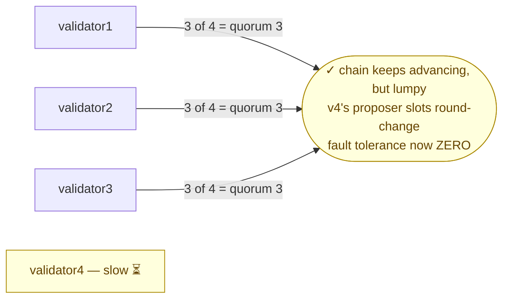

# Scenario 03 — Slow Peer (network degradation)

The first two scenarios took validators all the way out — killed
([01](../01-validator-loss/)) or isolated ([02](../02-network-partition/)). This
one leaves a validator **up and `Ready`** but degrades its network, and asks the
quieter question: where does slow consensus-message propagation start to hurt,
and what does it look like before anything actually fails?

With N=4, the other three validators are **exactly** the BFT quorum
(2f+1 = 3). So a single degraded validator should **not** halt the chain — the
three healthy nodes keep committing. The interesting effects are subtler, and
worse for an operator precisely because nothing pages:

- When the slow node is the **round's proposer**, its proposal arrives late (or
  is lost), the round times out, and consensus round-changes to the next
  proposer. Block production continues, but with periodic gaps — roughly every
  Nth block, on the slots where the slow node would have proposed.
- A degraded validator is **effectively excluded** from consensus without any
  formal removal — and the moment it is, the network runs at exactly quorum with
  **zero fault tolerance**. One more fault now halts it (the
  [quorum-loss](../01-validator-loss/#step-2--quorum-loss-chain-halts) cliff edge).

The injection shapes **egress only** (the simplest reliable `netem` setup), so it
models a validator whose _outbound_ path is degraded. A node degraded only on
egress still receives blocks promptly, so it tends to stay in sync as a follower
and shows the damage mainly when it proposes — a useful distinction in itself.

**Consensus:** run against both **QBFT** and **IBFT 2.0**. The fault is
engine-independent — both gate proposer slots on the same `requesttimeoutseconds`
round timer, so the cliff is the same mechanism measured under
[quorum loss](../01-validator-loss/#step-2--quorum-loss-chain-halts) — and the
measured behaviour was near-identical on both (see [Observed](#observed)). Select
the engine with `CONSENSUS` (it must match the deployed release):

```sh
make install   CONSENSUS=ibft2   # deploy IBFT 2.0 (default: qbft)
make scenario-03 CONSENSUS=ibft2 # run against it
```



## Hypothesis

Degrade one validator's egress in escalating steps and the chain keeps producing
on 3-of-4 throughout — but once the added latency pushes that node's proposal
round-trip past `requesttimeoutseconds`, its proposer slots start to time out and
round-change to a healthy node, showing up as a recurring `Round>0` commit
roughly every Nth block. The degraded node, shaped on egress only, stays in sync
as a follower and catches up the instant the shaping is removed. Throughout, every
pod stays `Ready` and RPC keeps answering — a **silent** degradation that removes
the network's fault tolerance without announcing itself.

## Method

Apply `tc netem` to the target validator's `eth0` (validator4 by default,
override with `TARGET_VALIDATOR`), via the same privileged ephemeral container
used for the [partition scenario](../02-network-partition/)
(`ensure_netns_container` / `netns` in [`scripts/lib.sh`](../../scripts/lib.sh) —
`tc` here instead of `iptables`). Three escalating steps, each held for
`DEGRADE_WINDOW` (default 40s):

- **3a — latency:** `netem delay 400ms`.
- **3b — latency + loss:** `netem delay 800ms loss 25%`.
- **3c — past the cliff:** `netem delay 12000ms` (> `requesttimeoutseconds=10`).

Then remove the qdisc and confirm the node catches back up.

```sh
make scenario-03
```

Liveness is measured against a **healthy** validator (validator1) so the slow
node's own degraded RPC doesn't skew the reading. For each step the script logs
the slow node's gap behind head and the round-change count on a healthy node
(blocks imported at `Round>0` over the window).

Assertions: chain advancing at baseline → still advancing (via a healthy node)
under 3a, 3b and 3c → under 3c at least one block commits at `Round>0` (the slow
node's proposer slot timing out) → after the qdisc is removed, the slow node
catches back up to within a few blocks of head.

## Expected

- The chain keeps advancing under all three degradation levels — three healthy
  validators retain quorum.
- Round-change activity rises only once the added latency crosses
  `requesttimeoutseconds`, clustered on the rounds where the slow node would
  propose; mild degradation well under the timer is absorbed.
- The egress-degraded node stays roughly in sync as a follower; any gap closes
  once the qdisc is removed.
- Headline operational point: a slow validator does **not** announce itself as a
  failure — pods stay `Ready`, the chain keeps moving — but it injects latency
  spikes and removes your fault tolerance. It is a silent degradation.

## Observed

Both engines behaved as hypothesised and near-identically: mild and moderate
degradation was absorbed with no effect, and only once the egress delay crossed
`requesttimeoutseconds` did the slow node's proposer slots round-change — while
the chain kept advancing on 3-of-4 the whole time and the node recovered the
instant the shaping was removed. One run per engine, kind v0.32.0 (macOS/arm64,
kubectl 1.36.1, **chart 0.2.3**, Besu 26.6.0, 2s block period,
`requesttimeoutseconds` 10), validator4 degraded.

| Engine   | 3a (400ms)             | 3b (800ms+25% loss)    | 3c (12s delay) — Round>0 blocks                      | Slow-node RPC under 3c | Recovery on unshape          |
| -------- | ---------------------- | ---------------------- | ---------------------------------------------------- | ---------------------- | ---------------------------- |
| QBFT     | no effect, gap 0, 0 RC | no effect, 0 RC        | **4 blocks at Round=1** (seq 232, 235, 238, …)       | unreachable            | gap 0 instantly, no catch-up |
| IBFT 2.0 | no effect, gap 0, 0 RC | no effect, gap 0, 0 RC | **4 blocks at Round=1** (seq 4301, 4304, 4307, 4310) | unreachable            | gap 0 instantly, no catch-up |

- **3a (delay 400ms): no effect, both engines.** Chain advanced normally, the
  slow node stayed at head (gap 0), zero round-changes. 400ms is trivial against
  a 10s round timeout.
- **3b (delay 800ms + 25% loss): still no effect, both engines.** Zero
  round-changes; the chain kept advancing via a healthy node throughout. The
  consensus wire protocol (RLPx) runs over **TCP**, which retransmits through 25%
  loss; 800ms + retransmits is still far under the 10s timeout. **Moderate
  single-node degradation is simply a non-event for either engine — more
  resilient than the hypothesis assumed.** (The slow node's own RPC occasionally
  exceeded the probe's 5s timeout under the loss, reading the gap as "unknown" for
  a sample — a degraded-RPC artefact, not a real lag; it was back to gap 0 at
  once.)
- **3c (delay 12s, just over `requesttimeoutseconds=10`): the cliff, both
  engines.** Now the slow node's proposal can never reach the others before their
  round-0 timer fires. Its proposer slots round-changed to a healthy node — the
  healthy node logged blocks committed at **`Round=1`** on the slow node's
  recurring proposer slots (QBFT seq 232/235/238…, IBFT 2.0 seq 4301/4304/4307/4310),
  while round-0 (healthy-proposer) blocks committed normally. **The chain kept
  advancing on 3-of-4 throughout**; it just produced in bursts, stalling ~10s on
  each slot the slow node should have proposed.
- **The slow node was effectively excluded, not removed.** Under the 12s delay
  its own RPC became unreachable (egress > the 5s client timeout) and it stopped
  contributing proposals — yet it remained a validator and, because egress-only
  shaping leaves ingress intact, stayed **in sync as a follower** (gap 0 again the
  instant the qdisc was removed, on both engines). No catch-up was needed, and the
  mesh returned to a full `3/3/3/3` post-recovery.
- **The real danger is silent:** under 3c every pod stayed `Ready` and the chain
  kept moving, so nothing pages — but the network was running at exactly quorum
  with **zero fault tolerance**. One more fault and it is
  [quorum loss](../01-validator-loss/#step-2--quorum-loss-chain-halts).
- **The cliff is set by `requesttimeoutseconds`** (10s here): degradation whose
  added message latency stays well under it is absorbed; degradation that pushes a
  proposer's round-trip past it costs that proposer its slot. This is the same
  round timer whose _backoff_ governs quorum-loss recovery in
  [scenario 01, Step 2](../01-validator-loss/#step-2--quorum-loss-chain-halts) —
  here it sets the _tolerance_ edge rather than the recovery curve.

**Consensus comparison.** Engine-independent, as expected: both QBFT and IBFT 2.0
absorbed 3a and 3b with zero round-changes and crossed the cliff at the same 12s
point, producing four `Round=1` commits on the slow node's proposer slots while
advancing on 3-of-4, and both recovered instantly on unshape with no catch-up.
The only engine difference is cosmetic — the **log line that carries the committed
round differs**: QBFT logs `QbftRound | Importing proposed block to chain …
Round=N`, IBFT 2.0 logs `IbftRound | Importing block to chain … Round=N`. Both
stamp `Sequence=X, Round=Y`; the runbook diagnosis matches either phrasing.

## Variations

- **Symmetric (ingress + egress) shaping** via an `ifb` redirect, to model a
  genuinely slow link rather than slow egress only — this should make the node
  fall behind as a follower, not just as a proposer.
- **Find the cliff precisely:** sweep `delay`/`loss` upward until the slow node is
  fully excluded, and correlate with `requesttimeoutseconds` — at what point does
  its proposer slot _always_ time out?
- **Degrade two validators** so the healthy set drops below quorum — this should
  converge on [quorum loss](../01-validator-loss/#step-2--quorum-loss-chain-halts)
  and is the practical meaning of "no fault tolerance left."
- **CPU starvation (same symptom, different cause).** Clamp one validator's CPU
  (a tight cgroup limit / privileged ephemeral container writing the cgroup, or a
  redeploy with a low CPU limit — k8s won't change a running pod's limit in place)
  so it falls behind on signing. The observable is the _same_ as network slow-peer
  — its proposer slots round-change — but the cause is **compute-bound, not
  network-bound**, and operators routinely conflate the two. Not worth a separate
  scenario (it reproduces this one's finding), but worth knowing the disambiguation:
  check NIC/latency vs CPU throttling / `top` to tell them apart.

## Runbook entries backed by this scenario

- [Erratic block times / periodic stalls (degraded
  validator)](../../runbook/04-erratic-block-times-slow-validator.md) — the
  signal is recurring `Round>0` commits on one proposer's slots while every pod
  stays `Ready`; the chain is safe but running with zero fault tolerance.
