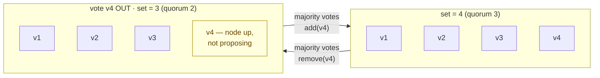
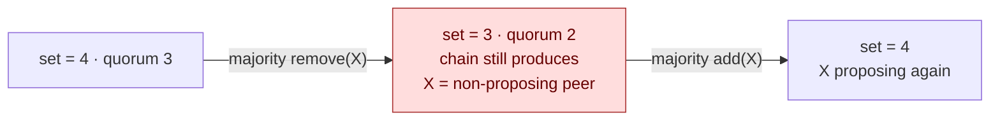
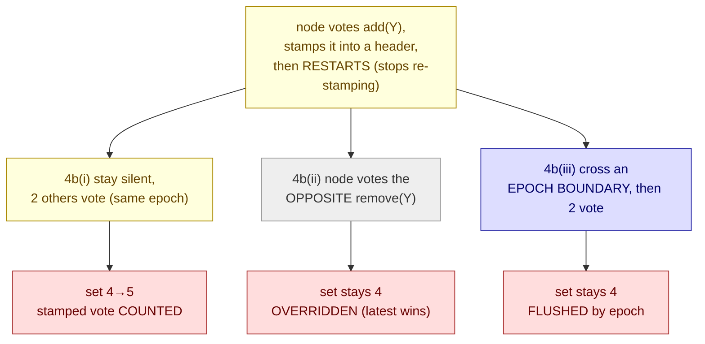
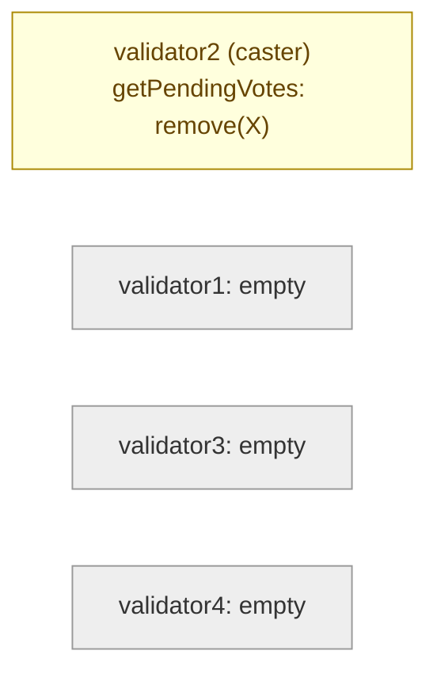
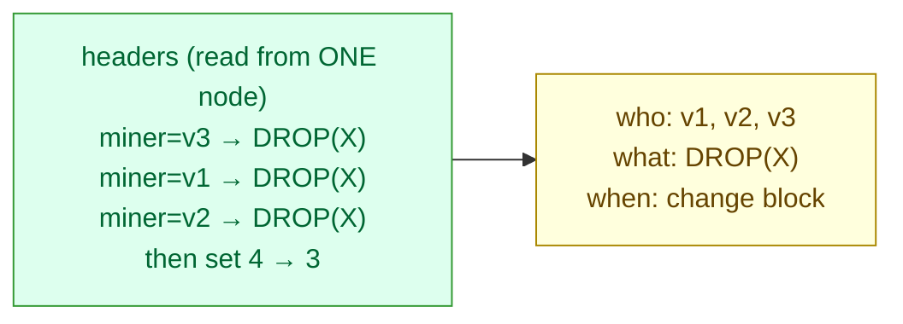

# Scenario 04 — Validator-Set Governance (vote-based remove + re-add)

The first three scenarios kept the validator set fixed and perturbed it: a node
killed ([01](../01-validator-loss/)), isolated ([02](../02-network-partition/)), or
degraded ([03](../03-slow-peer/)). Each was a _transient_ fault; the set was always
still `{v1,v2,v3,v4}`, waiting for the node to come back. This scenario changes the
set itself, deliberately and at runtime: the existing validators vote a member out
and back in, with no restart and no genesis/chart change.

It is the durable counterpart to scenario 01. There a validator went down and the
chain waited for it; here the operator decides the member is gone for good (or that a
new one should join) and the consensus layer is reconfigured to match. This is the
_intended_ path the same RPCs make available, and, in the wrong hands, the
_unintended_ one (a silent membership change), which is why it earns a
[runbook entry](../../runbook/05-validator-set-governance.md).

With N=4 a change needs more than half of the current validators to propose the same
vote (`<engine>_proposeValidatorVote(address, add?)`), each on its own node. Voting a
member out drops the set to 3 (quorum `ceil(2·3/3)=2`, so the chain keeps producing),
and the removed node keeps running as a non-proposing peer until it is voted back in.

**Consensus:** engine-independent, and runs unchanged against both **QBFT** and
**IBFT 2.0**. Both expose the identical vote/discard/getValidators RPCs; only the
namespace differs (`qbft_*` vs `ibft_*`), which the script resolves from `CONSENSUS`
via `consensus_rpc_ns` in [`scripts/lib.sh`](../../scripts/lib.sh). The full 4a–4d run
was executed on both engines and behaved near-identically (see [Observed](#observed)).
This exercises the _vote/header-based_ validator management both engines share,
distinct from QBFT's optional [_smart-contract-based_ management](https://docs.besu-eth.org/private-networks/how-to/configure/consensus/qbft) —
where the validator set is [changed without voting](https://docs.besu-eth.org/private-networks/how-to/configure/consensus/add-validators-without-voting) —
which this scenario does not cover. Select the engine with `CONSENSUS` (it must match the deployed
release):

```sh
make install   CONSENSUS=ibft2   # deploy IBFT 2.0 (default: qbft)
make scenario-04 CONSENSUS=ibft2 # run against it
```



## Hypothesis

A vote can live in two places: a node's memory (the operator's pending intent via
`proposeValidatorVote`, _ephemeral_) and the block headers (votes stamped on-chain,
_permanent_). Each step probes a different one. (An _epoch_ is just a fixed span of
`epochlength` blocks; at each epoch boundary Besu clears the running vote tally, so a
vote that hasn't yet reached majority can be flushed there — the reset that several of
the steps below hinge on.) _Diagram colours:_ yellow = a
vote/intent, green = on-chain/permanent, grey = empty/blind, red = wiped or
set-changed, blue = epoch.

### 4a — lifecycle

Casting "remove X" on a majority of the current validators (3 of 4) drops X from the
set a few blocks later, on majority rather than at an epoch boundary (proven below on
a 30000-block epoch). The chain keeps producing at N=3 (quorum 2) with no pause and no
restart; the removed node stays `Running` and keeps importing blocks but, being out of
the set, proposes nothing. Casting "add X" on a majority restores it and it resumes
proposing. No quorum loss, fully reversible.



### 4b — a restart drops intent, but does not retract an already-cast vote

`proposeValidatorVote` records the operator's intent in that node's memory, not
persisted, so a restart (upgrade, crash, reschedule) silently drops it and the node
stops _re-stamping_. But a vote it already wrote into a header is on-chain and keeps
counting toward the tally. A restart is a silent stop going forward, not an undo.
Three experiments make this precise, using a phantom 5th-validator address (no node,
just an address), so the real four are never touched (N=4 → majority 3):

- **4b(i)** Restart, then stay silent: the already-cast vote still counts. A node votes
  `add(Y)`, lets it stamp into a header, restarts (`getPendingVotes` → `{}`), then two
  others vote `add(Y)`. `Y` is added (set 4→5): the restarted node's stamped vote counted
  (2 live + 1 restarted-stamped = 3).
- **4b(ii)** Restart, then vote the opposite: it is overridden. Same start, but the
  restarted node then votes `remove(Y)`. `Y` is not added, because a validator's _latest_
  vote wins and the opposite supersedes the stamped add. This is how you actually retract.
  (A deliberate `discardValidatorVote` behaves like the restart: it only stops _future_
  re-stamping, and a vote already in a header keeps counting until an opposite vote or the
  epoch boundary clears it. See the runbook.)
- **4b(iii)** Restart, then cross an epoch boundary: the abandoned vote is flushed. Same
  start, but the chain crosses an epoch boundary before the two others vote. `Y` is not
  added: the restarted node never re-stamps, so once the epoch resets the collected tally
  its prior-epoch vote is gone, leaving only the 2 live votes. The converse of
  [4c(ii)](#4cii--does-the-epoch-expire-it): a _live_ proposal survives the epoch, an
  _abandoned_ one is flushed.



### 4c(i) — a standing proposal is per-node

`getPendingVotes` reports only the node's own proposals; a vote cast on one validator
is invisible from another. To know the cluster's true governance state you must query
every validator, not one.



### 4c(ii) — does the epoch expire it?

Besu resets validator votes at each epoch (`epochlength` blocks), so the natural
expectation is that a standing proposal clears at the boundary. Observed: it does not.
The proposal persists across the boundary, matching the Besu docs: _"existing
proposals remain in effect and validators re-add their vote the next time they create
a block."_ So a standing proposal is bounded only by a restart (4b) or an explicit
discard, not by the epoch: on a running node a forgotten vote is effectively
indefinite.


### 4d — one node can still reconstruct who voted

4c(i) shows you can't read a peer's `getPendingVotes`, and in a real consortium you
operate only your own node with no RPC access to the others. But every vote is
on-chain: a block's `miner` is its proposer (the voter) and its `extraData` carries the
vote. So from one node alone you can pin the block where the set changed
(`getValidatorsByBlockNumber`) and read the votes, and the voters, out of the headers.



## Method

Operate only on the existing four nodes. Votes are cast on the per-validator RPC
services (`sbx-validator1..3`), since each vote is the casting node's own.

**4a — lifecycle (vote out + re-add):**

1. **Baseline** — confirm the set is 4 and the chain is advancing; pick the target
   address `X` (last in the sorted set).
2. **Remove** — `<engine>_proposeValidatorVote(X, false)` on `VOTERS`
   (default `1 2 3` = majority of 4). Poll `getValidatorsByBlockNumber` until `X` is
   gone and the set is 3; assert the chain still advances.
3. **Re-add** — `proposeValidatorVote(X, true)` on the same nodes; poll until `X` is
   back and the set is 4, then `discardValidatorVote(X)` and confirm `getPendingVotes`
   is empty.

For 4a, after re-add the script counts how many blocks `X` proposes in the window
since it rejoined (`<engine>_getSignerMetrics` over a block range) and asserts it is
`> 0` — a positive check that it resumed proposing. (The default `getSignerMetrics`
`proposedBlockCount` is a noisy sliding-window value that drifts ±1, so it is not used
as the signal.)

**4b — restart vs. an already-cast vote** (`RESTART_VALIDATOR`, default 1; `PHANTOM`
is the fake 5th address; `OTHER2` are two other voters). All three sub-experiments
first have the restart node `add(PHANTOM)` and confirm it stamped into a header (poll
`eth_getBlockByNumber`, since `PHANTOM` isn't in the set, any appearance of its address
in a header is a vote about it, so this is engine-agnostic), then restart the pod and
assert `getPendingVotes` is empty:

- **4b(i)** — after the restart, `OTHER2` vote `add(PHANTOM)`; assert the set reaches
  5 (the restarted node's stamped vote was the third).
- **4b(ii)** — after the restart, the node votes `remove(PHANTOM)` (opposite); then
  `OTHER2` vote `add(PHANTOM)`; assert the set stays 4.
- **4b(iii)** — after the restart, wait to cross an epoch boundary, then `OTHER2` vote
  `add(PHANTOM)`; assert the set stays 4. Short-epoch only (must cross a boundary),
  auto-skips on the default 30000 epoch. Each experiment votes `PHANTOM` back out
  afterward to restore the clean 4-set.

**4c(i) — per-node visibility:** cast a minority vote on one node (`VOTE_NODE`,
default 2) and read `getPendingVotes` on both that node and a peer (`PEER_NODE`,
default 1). The caster reports the proposal; the peer must show `{}`.

**4c(ii) — epoch boundary:** only runs on a short-epoch deploy (genesis is immutable,
so a fresh chain, see below); it auto-skips when `epochlength` is too large to cross
in-session. With the minority vote still standing on the caster, it waits for the chain
to cross the next epoch boundary and re-reads the caster's pending vote and the set.

```sh
make scenario-04                              # 4a, 4b(i/ii), 4c(i), 4d; the epoch steps 4b(iii)+4c(ii) skip on the default 30000 epoch

make install   CONSENSUS=qbft EPOCHLENGTH=50  # fresh low-epoch chain to enable the epoch steps
make scenario-04 CONSENSUS=qbft               # now 4b(iii) and 4c(ii) run too
```

`EPOCHLENGTH` overrides `consensusConfig.epochlength`; because genesis is immutable it
requires a reinstall with fresh PVCs, which is why the epoch-boundary steps are gated
rather than inline.

**4d — single-node forensics:** using only validator1's RPC (simulating a consortium
operator with access to just their own node), reconstruct the 4a removal from chain
data alone: binary-search `getValidatorsByBlockNumber` for the block where the set
dropped 4→3, then scan the preceding headers (`eth_getBlockByNumber`) for the
drop-vote, reading the voter from each block's `miner` and the vote from its
`extraData`. The vote element is `d694<address><type>`, with `<type>` = `80` (QBFT) or
`00` (IBFT 2.0).

Assertions: set 4 at baseline → `X` removed and size 3 within `APPLY_TIMEOUT`
(default 60s), chain still advancing at N=3 → `X` re-added, size 4, proposes again
(blocks-since-rejoin > 0), no pending votes → (4b i) after a restart the stamped vote
still counts, set 4→5 → (4b ii) a post-restart opposite vote overrides it, set stays 4
→ (4b iii) across an epoch boundary the abandoned vote is flushed, set stays 4 → (4c i)
the caster reports the proposal and the peer reports `{}` → (4c ii) the caster's
proposal is still pending after the epoch boundary → (4d) the change block is pinned
and ≥2 distinct voters are read from headers using one node only.

## Expected

A pass checklist; the reasoning is in [Hypothesis](#hypothesis), the results in
[Observed](#observed):

- **4a** vote-out applies on majority (not at an epoch), set 4→3 with no pause; re-add
  restores it and it proposes again. (Down to 3 = zero fault tolerance; the
  [quorum-loss](../01-validator-loss/README.md#step-2--quorum-loss-chain-halts) cliff is
  one fault away.)
- **4b** a restart empties the node's `getPendingVotes`, but its already-stamped vote
  (i) still counts (set 4→5), unless (ii) an opposite vote overrides it or (iii) an
  epoch boundary flushes it (both leave the set at 4).
- **4c** (i) the proposal shows only on the caster, `{}` on peers; (ii) a _live_
  proposal survives the epoch boundary, set unchanged.
- **4d** from one node, the change block is pinned and ≥2 distinct voters are read out
  of the headers.

## Observed

Verified on both QBFT and IBFT 2.0 (chart 0.3.3, Besu 26.6.1, kind on macOS/arm64, 2s
block period, `requesttimeoutseconds 10`), set
`{5e6bb0a9, 9418ba4c, c156280, c4393b1c}`, target `c4393b1c`. The full 4a–4d run was
recorded on a fresh `epochlength 50` chain (`make install EPOCHLENGTH=50`) on each
engine so the epoch-boundary steps (4b iii, 4c ii) are reachable in-session; 4a, 4b(i),
4b(ii) were independently confirmed on the default `epochlength 30000` too. The two
engines behaved near-identically:

| Step                            | QBFT                                   | IBFT 2.0                               |
| ------------------------------- | -------------------------------------- | -------------------------------------- |
| 4a · Vote OUT (3 of 4)          | applied **9s**, set → 3                | applied **9s**, set → 3                |
| 4a · Vote IN (3 of 3)           | applied **6s**, set → 4                | applied **6s**, set → 4                |
| 4a · Re-added node              | proposed **5 blocks** since rejoin     | proposed **5 blocks** since rejoin     |
| 4b(i) · restart, stay silent    | stamped vote counts → **set 4→5**      | stamped vote counts → **set 4→5**      |
| 4b(ii) · restart, vote opposite | overridden → **set stays 4**           | overridden → **set stays 4**           |
| 4b(iii) · restart, cross epoch  | flushed → **set stays 4**              | flushed → **set stays 4**              |
| 4c(i) · caster vs peer          | caster `{…:false}`, peer `{}`          | caster `{…:false}`, peer `{}`          |
| 4c(ii) · across epoch bdry      | **still** `{…:false}` (live re-added)  | **still** `{…:false}` (live re-added)  |
| 4d · forensics (1 node)         | change block pinned, **3 voters** read | change block pinned, **3 voters** read |
| Post-recovery                   | full mesh `3/3/3/3`                    | full mesh `3/3/3/3`                    |

The table is the result; the mechanism is in [Hypothesis](#hypothesis). What the
numbers confirm:

- **4a** applied on majority in ~9s, not at the 30000-block epoch (~16.7h away at 2s),
  matching the Besu docs: _"When more than 50% of the existing validators have published
  a matching proposal, the protocol adds the proposed validator."_ The set dropped to 3
  and kept advancing (`assert_chain_advancing` passed at N=3); re-add restored 4 and
  `c4393b1c` proposed 5 blocks within ~10s of rejoining. Quorum never broke (4→3→4, the
  safe offboard versus the halt in
  [scenario 01, Step 2](../01-validator-loss/README.md#step-2--quorum-loss-chain-halts)).
  A standing proposal still reports in `getPendingVotes` after it applies (a no-op);
  `discardValidatorVote` clears it. (Block counts come from `getSignerMetrics` over the
  post-rejoin range, not the default `proposedBlockCount`, which drifts ±1.)
- **4b** the restarted caster's `getPendingVotes` came back `{}`, so it stops
  re-stamping, but its already-stamped header vote is another matter: (i) it still
  counted, set 4→5; (ii) a post-restart opposite `remove` overrode it (latest vote wins,
  the real way to retract), set stayed 4; (iii) crossing an epoch boundary flushed the
  abandoned vote, set stayed 4. History is untouched (the stamped block stays on-chain,
  4d still reads it); the epoch flushes the _tally_, not the chain, and a rebooted node
  still rebuilds the correct set from headers.
- **4c(i)** a vote cast on validator2 read `{"0xc4393b1c…": false}` there and `{}` on
  validator1: the RPC reports only the queried node's own proposals. Query every
  validator to know the true governance state.
- **4c(ii)** the surprise: a _live_ minority proposal rode straight across the epoch
  boundary, still standing, set still 4. Per the docs the epoch _"discards all pending
  votes collected from received blocks"_ but _"existing proposals remain in effect and
  validators re-add their vote the next time they create a block."_ The exact converse
  of 4b(iii), a re-stamping node's vote survives, an abandoned one is flushed. A standing
  proposal is bounded by a restart or an explicit discard, not by the epoch; on a
  never-restarted node a forgotten vote is effectively permanent.
- **4d** using only validator1's RPC, the change block was pinned via
  `getValidatorsByBlockNumber` (binary search) and the preceding headers decoded: 3
  distinct validators had each stamped `DROP(c4393b1c)`, read from each block's `miner`
  (proposer = voter) and `extraData`. You cannot read a peer's `getPendingVotes` (4c i),
  but you don't need to, because the votes are on-chain.

_The "stop re-stamping ≠ retraction" rule applies to a deliberate `discardValidatorVote`
too, not just a restart: a vote already in a header keeps counting until an opposite vote
(4b ii) or the epoch boundary (4b iii) clears it. See the runbook's prevention notes._

Both engines ran the full 4a–4d and behaved near-identically. The only differences are
the RPC namespace (`qbft_*` vs `ibft_*`, resolved via `consensus_rpc_ns`) and the
one-byte vote-type encoding in `extraData` (`80` vs `00`).

## How votes are recorded on-chain (header anatomy)

This is the mechanism 4b, 4c(i) and 4d all rest on, and it is worth understanding on
its own: validator-management votes ride in the block header, not on a side channel. A
validator holds its vote locally in memory (`proposeValidatorVote`), which is why a
peer's `getPendingVotes` shows `{}` (4c-i). The vote becomes visible to the network only
when that validator gets a proposer slot and stamps it into the block it produces; every
node then sees it (blocks are gossiped to all) and counts it by scanning headers. So the
header is the channel, and the chain is the authoritative tally: your vote is private
intent until you propose, then it's on-chain for everyone.

Every block's `extraData` is RLP-encoded and carries both the current validator list
and a vote slot. Here is a real block from a running QBFT network
(`eth_getBlockByNumber("0x…", false)` → `.extraData`), with no governance in flight:

```
f90144                                              RLP list
  a0 0000…626573752032362e362e302d524331            32-byte vanity ("besu 26.6.0-RC1")
  f854 94<v1> 94<v2> 94<v3> 94<v4>                   the validator LIST (4 addresses)
  c0                                                 the VOTE slot — EMPTY (no vote)
  80                                                 round (0)
  f8c9 …                                             committed seals (signatures)
```

The block's `.miner` field is the proposer, and therefore the voter for whatever is in
that block's vote slot. During a governance change the slot is filled. The same position
in QBFT block 857 of our remove run read:

```
  d694 c4393b1ced8d49a2949f0e68af125ece1064829c 80   VOTE = [recipient, type] = DROP(c4393b1c)
```

**Vote-slot encoding** (verified on this build; `<addr>` is the 20-byte target):

|              | no vote | remove (DROP)  | add                  |
| ------------ | ------- | -------------- | -------------------- |
| **QBFT**     | `c0`    | `d694<addr>80` | `d794<addr>81ff`     |
| **IBFT 2.0** | `80`    | `d694<addr>00` | _(not decoded here)_ |

The only real divergence between the engines is the one-byte vote **type** (`80` =
RLP-false on QBFT, `00` = literal byte on IBFT 2.0) and the empty-slot marker (`c0` vs
`80`); the rest is identical.

**Reading it from one node** (the basis of the 4d forensic, no peer access needed):

```sh
# What was the set at block N?  → the list is in every header
qbft_getValidatorsByBlockNumber("0x<N>")          # convenience reader over extraData

# Who voted what, at block N?   → decode the header yourself
eth_getBlockByNumber("0x<N>", false)              # → .miner (the voter), .extraData (the vote)
```

A normal block shows the list and an empty vote slot; a governance block additionally
shows `d694<address><type>`, telling you that block's proposer (`.miner`) voted to
add/remove that address. That is how a single consortium member can audit every
membership change from their own node.

## Variations

- Onboard a _real_ new validator (5th node). 4b adds a phantom 5th (an address with no
  node) purely to exercise the vote tally; a genuine join means standing up a real Besu
  node with its own key, synced and peered, then voting it in, a chart-dependent
  follow-up (the chart deploys a fixed 4-validator set).
- Remove a degraded validator. Combine with [scenario 03](../03-slow-peer/): vote out the
  slow node and confirm the set shrinks cleanly, turning a silent degradation into a clean
  N=3.
- Vote toward sub-quorum. Vote out a _second_ validator and watch the set cross into
  [quorum loss](../01-validator-loss/README.md#step-2--quorum-loss-chain-halts); the
  practical meaning of "never remove below your fault-tolerance target."

## Runbook entries backed by this scenario

- [Changing the validator set (offboard / onboard a
  member)](../../runbook/05-validator-set-governance.md). The intended procedure (remove
  a dead member, add a new one) and the diagnosis path for an unexpected set change
  (votes reached majority without a planned change).
