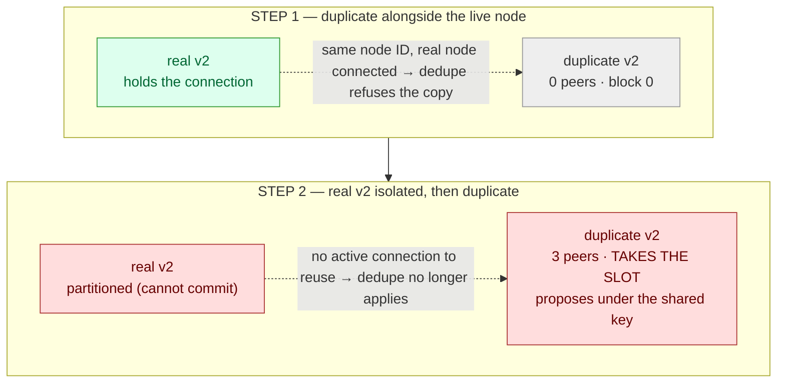

# Scenario 05 — Duplicate Validator Key (HA failover gone wrong)

The previous availability scenarios all removed capacity from the set: a validator
killed ([01](../01-validator-loss/)), isolated ([02](../02-network-partition/)), or
degraded ([03](../03-slow-peer/)). This one adds a node that should never exist: a
member accidentally runs a _second_ node carrying the same validator key, a
misconfigured active/active HA failover, or a stale replica that was never
decommissioned. Two nodes can now sign QBFT/IBFT messages for one validator address.

The fear this scenario tests is double-signing: two nodes equivocating under a single
identity, disrupting consensus or even forking the chain. The result is conditional,
and that condition is the finding. The one protection that keeps the copy out is
devp2p identity dedupe, and it holds only _while the real node is connected_:

- While the real validator is up (STEP 1), the copy is refused at the P2P layer (0
  peers, block 0) and the chain is unaffected.
- Once the real validator is unreachable (STEP 2, exactly the HA-failover situation
  this scenario is named for), that protection evaporates: the copy peers, syncs, and
  takes over the validator's proposer slot, signing blocks under the shared key
  (verified: 7 blocks in one window, against 0 for an isolated node with no copy
  present).

So the disruption is not nil. It is gated entirely by whether the real node still
holds its P2P connections, which is precisely what fails in the accident the scenario
models. A duplicate validator key is safe only as long as the original is alive and
connected.

Address-level quorum is never in question: the set is still `{v1,v2,v3,v4}`, four
addresses regardless of how many _nodes_ hold a given key. So this is not a quorum
scenario; it is a disruption scenario, and the disruption is real once the original
node drops.

**Consensus:** engine-independent (**QBFT · IBFT 2.0**). Nothing here is decided at
the consensus layer; the copy is gated at the P2P layer, identical for both engines.
Select the engine with `CONSENSUS` (it must match the deployed release).



## Hypothesis

A duplicate validator key, the classic HA-misconfiguration accident, is kept from
double-signing by exactly one mechanism, and that mechanism is conditional:

- devp2p identity dedupe: a node's devp2p identity is its node ID (derived from
  the key). The duplicate presents the same node ID as the live validator, so a peer
  that already holds an active connection to that node ID refuses or drops the copy.
  The load-bearing word is _active_: dedupe resolves a conflict between two live
  connections claiming one identity. Remove one side of the conflict, take the real
  node offline, and there is nothing left to dedupe against.

An earlier version of this scenario claimed a second, independent protection,
"StatefulSet DNS anchoring": peers only ever dial the real pod's DNS name, so a copy
on a different IP is never contacted. The re-verification below refutes that. It
accounted only for the direction _{v1,v3,v4} → v2_ and missed the copy dialing
_outward_. The duplicate is booted with the same `--bootnodes` and discovery as a real
validator, so it dials {v1,v3,v4} itself and they accept the inbound connection,
provided no active same-ID connection already exists. There is no independent DNS
anchor; there is only dedupe, and only while the original is up.

Two steps probe this, both realistic accident conditions (not contrived):

### STEP 1 — dedupe holds (duplicate alongside the live node)

The real validator stays up; the duplicate is deployed next to it. Hypothesis: the
copy is shut out at the P2P layer (same node ID, real node holds the connection), 0
peers, block 0, and the chain is unaffected (no round-changes from the duplicate).

### STEP 2 — dedupe evaporates (real node isolated, then duplicate deployed)

The real validator is network-isolated first (iptables DROP, as in
[scenario 02](../02-network-partition/)), _then_ the duplicate is deployed: the literal
HA-failover accident (primary unreachable, standby with the same key comes up).
Hypothesis (revised after the run): with the real node no longer holding its
connections, dedupe no longer refuses the copy; the duplicate peers, syncs, and takes
over the validator's proposer slot, signing blocks under the shared key. The chain does
not fork _here_ only because the real node is isolated (no competing proposal reaches
the mesh); the equivocation this sets up would surface the moment the real node
reconnects while the copy still runs.

## Caveat: the safety is deployment-level, conditional, and thinner than it looks

The STEP 1 "no incident" result is a property of how this network is wired (devp2p
node-ID dedupe), not a QBFT/IBFT protection against equivocation. Besu itself does not
prevent two nodes that share a key from both signing. STEP 2 demonstrates this directly
and without contrivance: isolate the real node (the ordinary failover trigger) and the
duplicate takes the proposer slot, signing under the shared key. An earlier write-up of
this scenario reported the copy staying out in STEP 2 too, and reserved actual
participation for a lab-only path (an iptables DNAT redirect that forces peers onto the
duplicate and then reconnects the real node, so both produce blocks under one key). The
re-verified result is blunter: that boundary is reached by STEP 2 alone, no DNAT, no
redirect, just an unreachable primary and a same-key standby. The DNAT path remains the
way to demonstrate the _fork_ (both nodes live and signing competing blocks); STEP 2
shows the copy needs only the primary's absence to start signing in its place. A
duplicate key does not need to be "defeated" into joining; it joins the moment the
original stops holding its connections.

**Why the workload type is load-bearing: StatefulSet vs Deployment.** STEP 2 needs a
deliberate act to create the second same-key node (deploy a copy, or later
`scale --replicas=2`). A Deployment behind a load-balancing Service creates one for
you, turning the fork case into an everyday operation. Its default rolling update brings
up a surge pod (`maxSurge` rounds up to 1 even at `replicas: 1`) before the old one
terminates, so an ordinary config change or restart transiently runs two live,
reachable same-key validators at once. Unlike STEP 2 (where the original is isolated),
here both are connected, which is the setup for genuine equivocation: peers reach
"validator2" through the Service, which round-robins across both pods, and each ends up
signing for the one address. (Shared storage makes it worse: two Besu processes on one
RocksDB/Bonsai directory corrupt it, since RocksDB is single-writer.) A StatefulSet
never spawns a second pod for a validator on its own (one pinned pod per ordinal,
replaced in place), so the only way to get a duplicate is the deliberate accident this
scenario injects. That is why the chart uses a StatefulSet, and why "use a StatefulSet,
not a Deployment, for validators" is a real prevention, not a cosmetic choice, though,
as STEP 2 shows, it bounds only how a duplicate is _created_, not whether one can sign
once it exists.

## Method

The duplicate is a throwaway pod built from the chart's own key secret
(`sbx-validator2-key`) and genesis (`sbx-genesis`), invoked like the real validators:
same node key, the same `--bootnodes` a real validator dials, and `--Xdns-*` so it
resolves DNS-based enodes. It is a full validator that dials outward, not a passive
listener. Its Besu image is read from the running target so it never straddles a
version. It is removed on exit. `TARGET` selects which validator to duplicate
(default 2).

**STEP 1:** deploy the duplicate alongside the live target, observe `OBSERVE` seconds
(default 60), then read the copy's `net_peerCount` and `eth_blockNumber` directly and
scan every real validator's log for equivocation / round-change signals. Assert the
chain still advances and the copy is shut out (peers 0, height 0).

**STEP 2:** read each validator's pod IP, DROP all traffic between the real target and
the other three (both directions, on the target and on each peer, via the shared
privileged ephemeral debug container, `ensure_netns_container` / `netns` in
[`scripts/lib.sh`](../../scripts/lib.sh)), then deploy the duplicate into that vacuum.
The double-sign check is the decisive measurement: capture the head at a healthy
validator before the copy can act, then after the window ask
`<engine>_getSignerMetrics` how many blocks the target's address proposed since that
baseline. Because the real node is isolated (it cannot get a proposal committed), any
such block was proposed by the duplicate, so a non-zero count is the copy signing under
the shared key. The target address is derived from the node key via `cast` (the key
secret holds only `nodekey`). A built-in control (`SKIP_DUP=1`) runs the same isolation
with no duplicate and asserts the count is 0, proving the isolation genuinely cuts the
real node out (its slots round-change), so the contrast, not an assumption, attributes
the blocks. Finally heal (remove the copy, flush the rules) and assert the network
recovers with no restart.

**STEP 3 — replica scale (opt-in).** The other two steps inject a standalone pod (label
`app: chaos-dup-validator`), so it is in no Service. STEP 3 instead reproduces the most
literal HA accident, `kubectl scale statefulset sbx-validator2 --replicas=2`, so the
duplicate is StatefulSet-managed and inherits the chart's pod labels, which puts it in
the validator Services. It then reads the replica's peers/height by pod IP, checks
whether `sbx-validator2-1` landed in the `sbx-rpc-unified` endpoints, samples the
unified RPC service to count stale/zero reads, and asserts the real chain still advances
(read via `sbx-validator1`, a Service that selects only validator1 and is never
polluted). It reverts by scaling back to 1 and deleting the orphan replica PVC. It is
opt-in: unlike STEP 1/2 it mutates a chart-managed StatefulSet and provisions a PVC, so
it is not in the default run.

```sh
make scenario-05                    # STEP 1 then STEP 2 (default; ephemeral, no StatefulSet change)
make scenario-05 STEP=1             # dedupe-holds only
make scenario-05 STEP=2             # partition trap only (duplicate takes the slot)
make scenario-05 STEP=2 SKIP_DUP=1  # partition-trap CONTROL: isolate, no duplicate (asserts 0 proposed)
make scenario-05 STEP=3             # replica scale (mutates the StatefulSet; opt-in)
make scenario-05 TARGET=3           # duplicate validator3 instead of validator2
```

STEP 1/2 include a safety net: a leftover partition is undone by recreating the affected
pods (a fresh netns has no DROP rules), so a failed run never leaves the network split.
STEP 3's safety net scales the StatefulSet back to 1 and drops the orphan PVC on exit,
even on early failure.

## Expected

- **STEP 1:** the duplicate reaches `Running` and Besu starts, but reports 0 peers /
  block 0; the chain keeps advancing; no equivocation or duplicate-driven round-change
  on the real validators (dedupe holds while the real node is connected).
- **STEP 2:** with the real node isolated, the duplicate peers (≈3) and takes the slot;
  `<engine>_getSignerMetrics` shows the target address proposing >0 blocks since the
  baseline, which (real node isolated) can only be the copy. The control (`SKIP_DUP=1`,
  isolate with no copy) shows the same address proposing 0 and its slots
  round-changing, proving the isolation is real. After heal the network resumes with no
  restart and no fork.
- **STEP 3 (opt-in):** the scaled replica reports 0 peers / block 0 and never proposes
  (dedupe holds here because the real `-0` pod is still live and connected, unlike
  STEP 2). But, being StatefulSet-managed, its `/liveness` readiness probe (RPC-up, not
  synced) admits it to the `sbx-rpc-unified` endpoints, so a fraction of client RPC
  reads return a stale/zero height until it syncs. Consensus is untouched; the impact is
  purely on the client read path.

## Observed

Verified on chart 0.3.3 (Besu 26.6.1, kind on macOS/arm64, 2s block period),
duplicating validator2 (address `0x9418ba4c…`) on a full-mesh baseline. The STEP 2
finding was measured on both QBFT and IBFT 2.0 with identical results: 7 blocks proposed
by the copy, 0 in the control. The table shows the QBFT run; IBFT reproduced the 0→7
swing exactly (it is a P2P-layer effect, below consensus).

| Step                        | duplicate peers | blocks proposed by v2's address (=copy) | verdict                                                   |
| --------------------------- | --------------- | --------------------------------------- | --------------------------------------------------------- |
| STEP 1 · dedupe holds       | **0**           | n/a (real node live)                    | copy shut out; chain unaffected                           |
| STEP 2 · partition trap     | **3**           | **7**                                   | **copy took the slot — signed under the shared key**      |
| STEP 2 · control (`SKIP_DUP`) | —             | **0**                                   | isolation confirmed: real node signs nothing while cut off |
| STEP 3 · replica scale      | **0**           | 0 (real `-0` pod still live)            | deduped; but **2/12** unified-service reads stale/zero    |

- **STEP 1** — dedupe holds. The duplicate reached `Running` and Besu fully started,
  but held 0 peers and stayed at block 0 for the whole 60s window; the chain advanced
  (6834 → 6870) and no block committed at `Round>0`. The only round activity was in the
  _duplicate's own_ log (`Waiting for 5 peers minimum`, then `Moved to round 2`), the
  copy spinning in isolation. While the real node holds the connection, devp2p identity
  dedupe refuses the copy: a duplicate key does not stall the network via consensus as
  long as the original is live.
- **STEP 2** — the copy takes the slot. With the real validator2 iptables-isolated from
  {1,3,4}, the duplicate peered (3 peers), synced to head (533), and its address
  proposed 7 blocks over the window (per `getSignerMetrics` at a healthy validator), and
  `Round>0` fell to 2 (most of v2's slots no longer round-changed because the copy was
  filling them). Since the real node is isolated it cannot get a proposal committed, so
  those 7 blocks are the copy signing under the shared key. The control confirms it: the
  identical isolation with no duplicate deployed had v2's address propose 0 blocks and
  `Round>0=5` (all of v2's slots round-changed), so the isolation genuinely cuts the real
  node out, and the 0→7 swing is entirely the copy. (The isolated real v2's own
  `net_peerCount` still read 3 at the 12s settle, since RLPx entries evict slowly, but it
  committed nothing, confirming the reading is a lag artifact, not a live path.) After
  removing the copy and flushing the rules, the mesh recovered to a full `3/3/3/3`, no
  restart, no fork.
- **STEP 3** — replica scale (opt-in). Scaling `sbx-validator2` to 2 created
  `sbx-validator2-1` on the same key. It held 0 peers / block 0 and committed nothing
  (`Round>0=0`), because here the real `sbx-validator2-0` pod is still live and
  connected, so dedupe applies exactly as in STEP 1. Consensus was untouched and the real
  chain advanced (read via `sbx-validator1`). The wrinkle is elsewhere: the replica
  inherits the chart's pod labels, and its `/liveness` probe passes on RPC-up alone, so
  it joined the `sbx-rpc-unified` endpoints while un-synced; 2 of 12 sampled reads
  through the unified service returned a stale/zero height. Reverting to one replica (and
  deleting the orphan `data-sbx-validator2-1` PVC) restored a clean `3/3/3/3`.

A duplicate validator key is contained by exactly one thing, devp2p dedupe, and only
while the original node is live and connected. STEP 1 and STEP 3 (original up) show the
copy shut out; STEP 2 (original isolated, the failover accident itself) shows the copy
taking the proposer slot and signing under the shared key. The protection is at the P2P
layer, not the consensus layer (Besu does not stop two nodes sharing a key from both
signing, see the
[caveat](#caveat-the-safety-is-deployment-level-conditional-and-thinner-than-it-looks)),
and it is conditional on the very thing that fails in an HA misconfiguration. STEP 3 also
adds a monitoring gotcha: a StatefulSet-scaled duplicate stays out of consensus but
pollutes the client RPC read path until it syncs.

## No runbook entry

This scenario backs no runbook entry, but not because "nothing happens." STEP 2 is a
real incident (the copy takes the proposer slot), yet its fix is not a recovery
procedure you run _after_ the fact; it is prevention and containment: never let a second
node hold the key, and if one exists, stop it. There is no "restore the chain" step
because the chain never halts or forks in the injected case (the original is isolated);
the danger is the equivocation that would follow if the original reconnected while the
copy ran. So what this scenario yields is a sharpened prevention, which lives here rather
than in a recovery runbook:

- Never share a validator key across nodes. The one containment mechanism (devp2p dedupe)
  protects only while the original is live and connected, which is exactly what fails in a
  failover.
- Run validators as a StatefulSet, not a Deployment behind a Service. A StatefulSet won't
  spawn a second same-key pod on its own (see the
  [caveat](#caveat-the-safety-is-deployment-level-conditional-and-thinner-than-it-looks)).
- Keep a single active validator with a cold standby that boots only after the primary is
  confirmed down. Never active/active, and never a standby that comes up while the primary
  might still return.

## Variations

- Forced equivocation (the fork). STEP 2 shows the copy taking the slot while the
  original is _isolated_ (no competing proposal, so no fork). To demonstrate the actual
  fork, get both nodes live and signing at once: an iptables DNAT redirect of the
  target's p2p port onto the copy, then reconnect the real node, so both produce
  competing blocks under one key. Kept out of the injected scenario because it needs
  manipulation no accidental misconfig performs; STEP 2 already shows the copy needs only
  the primary's absence to start signing, and this marks where the halt-free takeover
  becomes a genuine two-signer fork.
