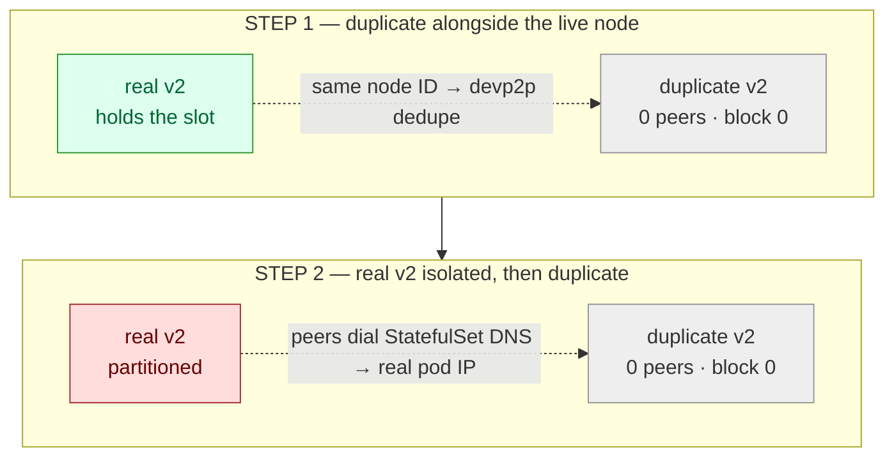

# Scenario 05 — Duplicate Validator Key (HA failover gone wrong)

The previous availability scenarios all **removed** capacity from the set — a
validator killed ([01](../01-validator-loss/)), isolated
([02](../02-network-partition/)), or degraded ([03](../03-slow-peer/)). This one
**adds** a node that should never exist: a member accidentally runs a _second_
node carrying the **same validator key** — a misconfigured active/active HA failover, or
a stale replica that was never decommissioned. Two nodes can now sign QBFT/IBFT
messages for **one** validator address.

The fear this scenario tests is **double-signing**: two nodes equivocating under a
single identity, disrupting consensus or even forking the chain. The result is
reassuring — **on this deployment the duplicate never joins consensus at all** —
but the _reason_ matters, and it is not the reason most operators assume (see the
[caveat](#caveat-this-is-deployment-level-safety-not-a-protocol-guarantee)).

Address-level quorum is never in question: the set is still
`{v1,v2,v3,v4}` — four **addresses**, regardless of how many _nodes_ hold a given
key. So this is not a quorum scenario; it is a **disruption** scenario, and the
disruption turns out to be nil.

**Consensus:** engine-independent (**QBFT · IBFT 2.0**). Nothing here is decided at
the consensus layer — the duplicate is stopped at the **P2P / Kubernetes**
networking layer, which is identical for both engines. Select the engine with
`CONSENSUS` (it must match the deployed release).



## Hypothesis

A duplicate validator key — the classic HA-misconfiguration accident — does **not** cause
double-signing or consensus disruption on this network, because two independent
mechanisms keep the copy out of the mesh before it can ever sign a competing
message:

- **devp2p identity dedupe.** A node's devp2p identity is its node ID (derived from
  the key). The duplicate presents the _same_ node ID as the live validator, so
  peers that already hold a connection to the real node refuse or drop the copy.
- **StatefulSet DNS anchoring.** Peers reach validators through the chart's
  per-validator `static-nodes` / bootnodes, which resolve a **StatefulSet** DNS name
  to the **real pod's IP**. A throwaway duplicate pod has a different IP that nobody
  is configured to dial, so it is never contacted — even if the real node is gone.

Two steps probe these in increasing severity, both **realistic accident
conditions** (not contrived):

### STEP 1 — devp2p dedupe (duplicate alongside the live node)

The real validator stays up; the duplicate is deployed next to it. Hypothesis: the
copy is shut out at the P2P layer (same node ID) — **0 peers, block 0** — while the
real node holds the connection, and the chain is unaffected (no round-changes from
the duplicate).

### STEP 2 — partition trap (real node isolated, then duplicate deployed)

Harder: the real validator is **network-isolated first** (iptables DROP, as in
[scenario 02](../02-network-partition/)), _then_ the duplicate is deployed — the
scenario where you might expect the copy to step into the vacated slot. Hypothesis:
it **still** can't, because peers dial the StatefulSet DNS → real pod IP, not the
copy. The duplicate stays **0 peers, block 0**; any round-change activity comes from
the _missing_ validator (a normal 3-of-4 effect, identical to scenario 02), **not**
from double-signing.

## Caveat: this is deployment-level safety, not a protocol guarantee

The "no incident" result is a property of **how this network is wired** — devp2p
node-ID dedupe plus StatefulSet DNS anchoring — **not** a QBFT/IBFT protection
against equivocation. **Besu itself does not prevent two nodes that share a key from
both signing.** A deeper investigation in the lab confirmed this: if you actively
defeat the network anchoring (redirect peers' p2p traffic to the duplicate with an
iptables DNAT and reconnect the real node), the duplicate _does_ participate and
**both nodes produce blocks under the one key** — QBFT absorbs it rather than
halting, but the equivocation is real. That path is deliberately **not** part of
this scenario: it requires manipulation no accidental HA misconfig performs, and it
exists only to mark the boundary of the safety shown here. The takeaway is precise:
**a duplicate key doesn't join by accident; it is not architecturally impossible.**

**Why the workload type is load-bearing — StatefulSet vs Deployment.** Both anchors
above are properties of running validators as a **StatefulSet**, not of Besu. Run
them as a **Deployment** behind a load-balancing Service and both evaporate.
Deployment pods have no stable per-pod DNS, so `static-nodes` can't pin a specific
pod — peers reach "validator2" through the Service, which **round-robins across every
replica that shares the key**. Two same-key pods then each hold a *slice* of the peer
set and both sign for the one address: the equivocation the manual DNAT had to force
above now arises on its own, just from the Service spreading connections. And it isn't
only a deliberate `scale --replicas=2` — a Deployment's default rolling update brings
up a **surge** pod (`maxSurge` rounds up to 1 even at `replicas: 1`) *before* the old
one terminates, so an ordinary config change or restart **transiently runs two
reachable same-key validators**. (Shared storage makes it worse: two Besu processes
on one RocksDB/Bonsai directory corrupt it — RocksDB is single-writer.) The
StatefulSet's one-pinned-pod-per-validator identity, dialed by stable name, is exactly
what makes the duplicate self-isolate in STEPs 1–3 — which is why the chart uses a
StatefulSet, and why "use a StatefulSet, not a Deployment, for validators" is a real
prevention, not a cosmetic choice.

## Method

The duplicate is a throwaway pod built from the chart's **own** key secret
(`sbx-validator2-key`), genesis (`sbx-genesis`) and config (`sbx-config-toml`),
invoked like the real validators (`--Xdns-*` so it accepts the DNS-based
static-nodes). It is removed on exit. `TARGET` selects which validator to duplicate
(default 2).

**STEP 1:** deploy the duplicate alongside the live target, observe `OBSERVE`
seconds (default 60), then read the copy's `net_peerCount` and `eth_blockNumber`
directly and scan every real validator's log for equivocation / round-change
signals. Assert the chain still advances and the copy is shut out (peers 0,
height 0).

**STEP 2:** read each validator's pod IP, DROP all traffic between the real target
and the other three (both directions, on the target _and_ on each peer — via the
shared privileged ephemeral debug container, `ensure_netns_container` / `netns` in
[`scripts/lib.sh`](../../scripts/lib.sh)), then deploy the duplicate into that
vacuum. Observe, assert the copy is _still_ shut out, then **heal** (remove the
copy, flush the rules) and assert the network recovers with no restart.

**STEP 3 — replica scale (opt-in).** The other two steps inject a _standalone_ pod
(label `app: chaos-dup-validator`), so it is in **no** Service. STEP 3 instead
reproduces the most literal HA accident — `kubectl scale statefulset sbx-validator2
--replicas=2` — so the duplicate is **StatefulSet-managed** and inherits the chart's
pod labels, which puts it in the validator Services. It then reads the replica's
peers/height by pod IP, checks whether `sbx-validator2-1` landed in the
`sbx-rpc-unified` endpoints, samples the unified RPC service to count stale/zero
reads, and asserts the **real** chain still advances (read via `sbx-validator1`, a
Service that selects only validator1 and is never polluted). It reverts by scaling
back to 1 and deleting the orphan replica PVC. It is **opt-in** — unlike STEP 1/2 it
mutates a chart-managed StatefulSet and provisions a PVC — so it is not in the
default run.

```sh
make scenario-05            # STEP 1 then STEP 2 (default; ephemeral, no StatefulSet change)
make scenario-05 STEP=1     # devp2p dedupe only
make scenario-05 STEP=2     # partition trap only
make scenario-05 STEP=3     # replica scale (mutates the StatefulSet; opt-in)
make scenario-05 TARGET=3   # duplicate validator3 instead of validator2
```

STEP 1/2 include a safety net: a leftover partition is undone by recreating the
affected pods (a fresh netns has no DROP rules), so a failed run never leaves the
network split. STEP 3's safety net scales the StatefulSet back to 1 and drops the
orphan PVC on exit, even on early failure.

## Expected

- **STEP 1:** the duplicate reaches `Running` and Besu starts, but reports **0
  peers / block 0**; the chain keeps advancing; **no** equivocation or
  duplicate-driven round-change on the real validators.
- **STEP 2:** the duplicate is **still 0 peers / block 0** even with the real node
  isolated; any `Round>0` blocks are the ordinary effect of a missing validator
  (cf. [scenario 02](../02-network-partition/)), not double-signing. After heal the
  network resumes with no restart and no fork.
- **STEP 3 (opt-in):** the scaled replica is **also 0 peers / block 0** and never
  proposes (same dedupe) — but, being StatefulSet-managed, its `/liveness` readiness
  probe (RPC-up, not synced) admits it to the `sbx-rpc-unified` endpoints, so a
  fraction of client RPC reads return a **stale/zero height** until it syncs.
  Consensus is untouched; the impact is purely on the client read path.

## Observed

Verified against the [besu-sandbox](https://github.com/jaravan/besu-helmcharts)
chart (0.2.3, Besu 26.6.0, 2s block period) on kind (`kind-besu-chaos`, QBFT),
duplicating validator2. Baseline was a full mesh — peers `3/3/3/3`, all four at the
same height, chain advancing.

| Step                    | duplicate peers | duplicate height | Round>0 (real net) | chain                                                                                      |
| ----------------------- | --------------- | ---------------- | ------------------ | ------------------------------------------------------------------------------------------ |
| STEP 1 · devp2p dedupe  | **0**           | **0**            | **0**              | advancing throughout                                                                       |
| STEP 2 · partition trap | **0**           | **0**            | 5 (missing v2)     | advancing on 3-of-4; full recovery after heal                                              |
| STEP 3 · replica scale  | **0**           | **0**            | **0**              | advancing on the real set (read via validator1); **3/12** unified-service reads stale/zero |

- **STEP 1 — devp2p dedupe.** The duplicate reached `Running` and Besu fully started
  (`Ethereum main loop is up`), but held **0 peers** and stayed at **block 0** for the
  whole 60s window; the chain advanced (12633 → 12669) and **no** block committed at
  `Round>0`. The only round activity was in the _duplicate's own_ log
  (`Waiting for 5 peers minimum`, then `Moved to round 2`) — the copy spinning in
  isolation, never reaching the real validators. devp2p identity dedupe isolates the
  copy while the real node holds the connection: HA key duplication does not stall the
  network via consensus while the real validator is live.
- **STEP 2 — partition trap.** With the real validator2's traffic to {1,3,4} dropped,
  the duplicate was **still 0 peers / block 0** — peers dial the StatefulSet DNS,
  which resolves to the real pod's IP, not the copy's. The chain advanced on the
  remaining three validators; the `Round>0=5` blocks were the ordinary effect of the
  **missing** v2 (identical to [scenario 02](../02-network-partition/)), **not** two
  nodes signing. (Note: at the 12s settle the isolated v2's own `net_peerCount` still
  read 3 — RLPx entries take longer than that to evict — yet the duplicate never
  picked up the slack, which is the point.) After removing the copy and flushing the
  rules, the mesh recovered to a full `3/3/3/3` at a common height, no restart.
- **STEP 3 — replica scale (opt-in).** Scaling `sbx-validator2` to 2 created
  `sbx-validator2-1` on the same key. It came up `Running` and held **0 peers / block
  0** the whole window and committed nothing (`Round>0=0`) — same node-ID dedupe, and
  peers still dial `sbx-validator2-0` via pod DNS, so consensus was untouched and the
  real chain advanced 18028 → 18073 (read via `sbx-validator1`). The **difference from
  STEP 1/2**: the replica inherits the chart's pod labels, and its `/liveness`
  readiness probe passes on RPC-up alone, so it **joined the `sbx-rpc-unified`
  endpoints while un-synced** — **3 of 12** sampled reads through the unified service
  returned a stale/zero height. Reverting to one replica (and deleting the orphan
  `data-sbx-validator2-1` PVC) restored a clean `3/3/3/3`.

The headline holds across all three: **an accidentally duplicated validator key does
not join consensus on this deployment.** The protection is at the P2P / Kubernetes
layer, not the consensus layer (see the
[caveat](#caveat-this-is-deployment-level-safety-not-a-protocol-guarantee)). STEP 3
adds the one real-world wrinkle: a StatefulSet-scaled duplicate stays out of
consensus but **pollutes the client RPC read path** until it syncs — a monitoring
gotcha, not a consensus failure.

## No runbook entry

Unlike scenarios 01–04, this one backs **no runbook entry** — by design. A runbook
entry documents an **incident and its recovery**; here there is no incident to
recover from (the duplicate self-isolates and is simply deleted). What this scenario
documents is a **defused fear**: it tells an operator that a duplicated key is not,
by itself, a consensus emergency on a StatefulSet deployment — and, via the
[caveat](#caveat-this-is-deployment-level-safety-not-a-protocol-guarantee), where
that comfort ends. The operational prevention (never share a validator key across
nodes; run validators as a **StatefulSet** — per-pod identity dialed by stable name —
**not** a Deployment behind a load-balancing Service, see the
[caveat](#caveat-this-is-deployment-level-safety-not-a-protocol-guarantee); and use a
single active validator with a cold standby that boots only after the primary is
confirmed down) lives in this README rather than in a recovery runbook.

## Variations

- **Forced equivocation.** Defeat the network anchoring with an iptables DNAT
  redirect of the target's p2p port and reconnect the real node; the duplicate then
  participates and both nodes produce under one key. This is the boundary referenced
  in the [caveat](#caveat-this-is-deployment-level-safety-not-a-protocol-guarantee)
  — kept out of the injected scenario because it is not an accidental condition.
