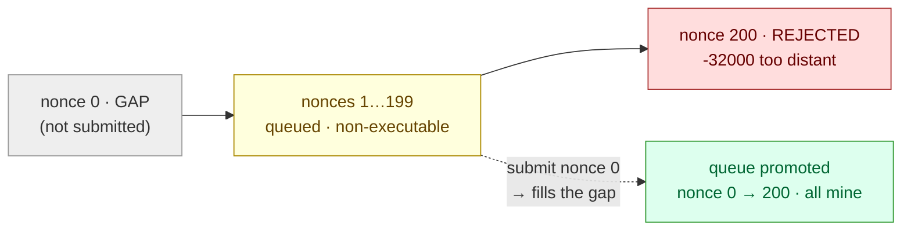

# Scenario 06 — Transaction Pool Flooding

Scenarios 01–05 all revolved around consensus: validators lost, isolated, degraded,
reconfigured, or duplicated. This one opens a different layer, the transaction
pipeline, with consensus left completely healthy. The question is no longer "does the
chain keep producing?" but "what happens to a _transaction_ under pressure: is it
dropped, queued, rejected, or silently stranded?"

We flood one sender's transaction queue and watch the pool at its limit: does Besu
drop transactions silently or reject them with an error? Do queued transactions mine
once they become executable? And, the subtle one, can a transaction be accepted yet
never mined? Reads and block production must stay healthy the whole time.

**Consensus:** engine-agnostic. This is a transaction-layer scenario; the validator
set and block production are untouched (and identical under QBFT or IBFT 2.0). It runs
against the main `sbx` network.

This sandbox runs free gas (`min-gas-price=0`), so gas economics are out of the
picture, but "free gas" does not mean "no funded account," which is exactly the trap
[6c](#observed) exposes.

The saturate-then-recover mechanic: one sender's future-nonce queue (a gap left at the
current nonce) and the gap-fill that drains it:



## Hypothesis

The most reproducible pressure point is Besu's per-sender future-nonce limit. A
transaction whose nonce is far above the sender's current nonce is non-executable
(there is a gap before it), so it sits in the pool instead of mining. Besu caps how
many such future transactions one sender may hold; beyond that it rejects further
submissions. The hypothesis:

- the pool rejects with an explicit JSON-RPC error, not a silent drop;
- a saturated _future_ queue does not stop executable transactions being accepted and
  mined;
- filling the nonce gap promotes the queued transactions and they mine in order;
- a zero-balance sender's transaction is accepted but never mined until the account
  holds any non-zero balance, and on a free-gas chain that (not the gas price) is what
  strands it;
- reads and consensus are unaffected: one sender cannot fill the global pool.

## Method

Run `cast` (foundry) in a pod (the shared `chaos-caster`, `ensure_caster` in
[`scripts/lib.sh`](../../scripts/lib.sh)) and drive it against the unified RPC, signing
with a genesis-funded dev account (`FUNDED_PK`).

- **6a** — saturate the future queue. Read the funded sender's current nonce `C`, then
  submit transactions from nonce C+1 upward (leaving a gap at `C`, so none are
  executable) until Besu rejects one. Record how many were accepted and the exact
  error; the sender's nonce must stay `C` throughout (nothing mined).
- **6b** — fill the gap, observe promotion. Submit the missing nonce C (executable).
  The queued futures become executable in order and mine; the nonce jumps to the top of
  the accepted range.
- **6c** — accepted ≠ mined: the zero-balance sender. A fresh (unfunded) key submits a
  valid zero-cost tx. It is accepted into the pool but not mined while the sender has
  zero balance; funding with 1 wei releases it.
- **6d** — RPC responsiveness. Confirm `eth_blockNumber` and block production keep
  working under load.

```sh
make scenario-06            # all four steps
make scenario-06 MAX_SUBMIT=260   # cap the future-nonce loop (default 260; cap is ~200)
```

## Expected

- Acceptance up to the per-sender future-nonce cap (Besu default 200: nonces within 200
  of the current nonce), then rejection with
  `-32000: Transaction nonce is too distant from current sender nonce`.
- The sender's nonce stays put while the queue is all future (held, not mined).
- After the gap nonce is submitted, the queue drains in order and the nonce advances to
  the top of the accepted range.
- The unfunded sender's tx is accepted with no error, sits pending while balance is
  zero, and mines once funded.
- Block production and RPC reads are unaffected; the per-sender cap is the protection
  against one sender filling the global pool.

## Observed

Verified on chart 0.3.3 (Besu 26.6.1, kind on macOS/arm64, foundry `cast`, QBFT, free
gas) against the main network. Funded sender `0x57F2fAA6…27c47`, starting nonce 0:

| Step              | Result                                                                                                                         |
| ----------------- | ------------------------------------------------------------------------------------------------------------------------------ |
| 6a · saturate     | **199** future txs accepted (nonces 1–199), **nonce 200 rejected** `-32000: …nonce is too distant…`; sender nonce stayed **0** |
| 6b · fill gap     | submitting nonce 0 promoted the whole queue — nonce jumped **0 → 200**                                                         |
| 6c · zero-balance | fresh key's tx **accepted** (hash returned), **unmined** at nonce 0 while the balance was zero; **1 wei** funding → mined, nonce **0 → 1** |
| 6d · health       | `eth_blockNumber` served, chain advancing throughout the flood                                                                 |

- **6a** With a gap left at nonce 0, nonces 1–199 were accepted (199 future txs) and
  nonce 200 was rejected with `-32000: Transaction nonce is too distant from current
  sender nonce`. The cap is explicit: Besu returns a JSON-RPC error the moment a sender's
  future window is full, rather than dropping silently. The sender's nonce stayed at 0 the
  whole time, proving the 199 queued txs were held, not mined.
- **6b** Submitting the missing nonce 0 made 1–199 executable; within a few seconds the
  sender's nonce jumped 0 → 200 (the 199 queued plus the gap-filler). Queued
  non-executable txs are not lost; they mine the instant the gap closes.
- **6c** — accepted ≠ mined. A fresh, zero-balance key's tx was accepted into the pool
  with no error (a hash came back) but did not mine while the sender had no balance; 8s
  later its nonce was still 0 (pending, not dropped). Funding with just 1 wei was enough:
  the same pending tx mined immediately (nonce 0 → 1), and the wei was not consumed (gas
  is free). The guard is binary (`balance == 0` vs `balance > 0`), not "can the sender
  afford the fee": any non-zero balance, even dust, clears it. A funded account mines fine
  at gasPrice 0, so the cause is the balance, not the gas price.

  Mechanically this is Besu's
  [`SenderBalanceChecker`](https://github.com/hyperledger/besu/blob/26.6.1/ethereum/eth/src/main/java/org/hyperledger/besu/ethereum/eth/transactions/layered/SenderBalanceChecker.java#L86)
  in the layered transaction pool (not block creation): its `WorldStateChecker` reads
  the sender's balance from the chain-head world state, and a pending tx whose sender has
  zero balance fails `hasEnoughBalanceFor`, so the pool holds it back from inclusion
  regardless of the (zero) transaction cost. The tx is admitted and even ranks in the
  pool, but the balance gate keeps it out of blocks (it logs `Sender has zero balance for
  transaction …`). "Free gas" removes the _fee_; it does not exempt a sender from needing
  a non-zero balance. The trap for a client: `eth_sendRawTransaction` succeeds and then
  waits forever for a receipt. The fix is a one-time dust transfer (genesis `alloc`,
  faucet, or treasury): onboarding, not ongoing funding.

- **6d** `eth_blockNumber` stayed responsive and height kept climbing throughout the
  flood. One sender cannot fill the global pool (the per-sender cap is that protection),
  and a saturated sender queue does not slow consensus.

In short: a full queue rejects with an error (monitor for `-32000`), queued txs are not
lost (they mine when executable), and a tx can be accepted yet never mined when the
sender's balance is exactly 0. On a free-gas chain the cause is an empty (never-funded)
account, not a low gas price.

## How the transaction pool is bounded

Besu ships two transaction-pool implementations, selected with `--tx-pool`; this chart
runs the default. They differ in _what bounds the pool_, which is where the `maxSize: -1`
below comes from:

| `--tx-pool`               | Bounded by            | Size limit (default)                     | Per-sender limit                             |
| ------------------------- | --------------------- | ---------------------------------------- | -------------------------------------------- |
| **`layered`** _(default)_ | **memory** (bytes)    | `tx-pool-layer-max-capacity` — **50 MB** | `tx-pool-max-future-by-sender` — **200** txs |
| **`sequenced`**           | **transaction count** | `tx-pool-max-size` — **4096** txs        | `tx-pool-limit-by-account-percentage`        |

`LEGACY` is a deprecated synonym for `sequenced` (flagged for removal). The two option
sets are mutually exclusive; Besu refuses to start if layered options are passed to the
sequenced pool or vice-versa.

The layered pool, what this chart runs, is bounded by memory, not a count.
`tx-pool-layer-max-capacity` (default 50 MB = `50 × 1_000_000` bytes) is the maximum
bytes of encoded pending-transaction data the node holds across its non-prioritised
layers. So "50 MB" is a memory budget, not a number of transactions; how many fit
depends on their size:

- a simple value transfer (this scenario's: 21000 gas, no calldata) is ~110 bytes, so
  hundreds of thousands fit;
- a data-heavy tx (e.g. a contract deploy with 50 KB of calldata) is ~50 KB, so only
  ~a thousand fit.

Bounding by bytes rather than count is deliberate: memory is the node's real
constraint, and a count would treat a 110-byte transfer and a 100 KB deploy as equal.
When stored bytes exceed the budget, Besu evicts the lowest-value / most-future
transactions. Two further layered limits bound a single sender's reach: at most 5000
_prioritised_ (next-block-candidate) txs, and at most 200 _future_ txs per sender, the
cap [6a](#observed) hit.

**Why `maxSize: -1`.** The `maxSize` field of `txpool_besuStatistics` is the count cap
`tx-pool-max-size`, a sequenced-pool option. On the default layered pool it does not
apply, so the field reads `-1`. That is not "unlimited": the 50 MB memory budget still
bounds the pool. To cap the layered pool, set `tx-pool-layer-max-capacity` (bytes); to
get a transaction-count cap, run `--tx-pool=sequenced`.

All values pinned to the chart's Besu (26.6.1):
[`TransactionPoolConfiguration`](https://github.com/hyperledger/besu/blob/26.6.1/ethereum/eth/src/main/java/org/hyperledger/besu/ethereum/eth/transactions/TransactionPoolConfiguration.java)
(the defaults `DEFAULT_PENDING_TRANSACTIONS_LAYER_MAX_CAPACITY_BYTES` 50 MB,
`DEFAULT_MAX_PRIORITIZED_TRANSACTIONS` 5000, `DEFAULT_MAX_FUTURE_BY_SENDER` 200,
`DEFAULT_MAX_PENDING_TRANSACTIONS` 4096, and the `Implementation` enum) and
[`TransactionPoolOptions`](https://github.com/hyperledger/besu/blob/26.6.1/app/src/main/java/org/hyperledger/besu/cli/options/TransactionPoolOptions.java)
(the `--tx-pool*` flags and their two option groups).

## Concurrent submitters (consortium reality)

In a consortium, several members submit transactions independently, often in the same
period. This does not trigger the per-sender rejection of [6a](#observed): that cap, and
the layered pool's per-account limits, are per account. Each member's own account has an
isolated future-nonce budget, so one member running ahead of _its own_ nonce cannot
reject another member's transactions. The proposer interleaves every account's
_executable_ (correctly-nonced) transactions into blocks up to the block gas limit, so
well-behaved concurrent submitters coexist.

Two resources are, however, shared across all submitters on a node:

- **the global pool** — the layered pool's memory budget (`tx-pool-layer-max-capacity`,
  50 MB) holds every account's pending transactions; sustained aggregate demand can fill
  it, at which point Besu evicts the lowest-priority / most-future transactions;
- **block throughput** — transactions mine only as fast as the block gas limit and block
  period allow; if the aggregate submission rate exceeds that, the pool backs up
  regardless of per-account caps.

On a free-gas network there is no fee market to arbitrate this contention: with every
transaction at `gasPrice 0`, Besu has no economic signal to prioritise between members,
so selection and eviction fall to arrival/sequence order. Two operating consequences:

- Rate-limit per member, not globally. A single global throttle penalises every member
  for one member's burst. Enforce a per-org / per-account fair share at each member's
  gateway (or a shared ingress) so each member keeps a guaranteed slice; the per-account
  caps already isolate one sender's queue, so the edge limit is for fairness and
  burst-smoothing, not for enforcing the pool cap.
- Sustained demand is a capacity question, not a policing one. Rate-limiting only smooths
  bursts. If legitimate aggregate demand exceeds throughput, raise it (block gas limit,
  block period) and size the pool (`tx-pool-layer-max-capacity`); throttling cannot create
  capacity that isn't there. (A single member can still pressure the _global_ pool by
  using many accounts; the per-account cap does not bound an org running N accounts, see
  [Variations](#variations).)

## Why public Ethereum doesn't hit this — the fee market

The contention above is a consequence of free gas. Public Ethereum handles the same
high-volume situation not by avoiding contention but by pricing it. Three fee-market
mechanisms do that work, none of which exist here:

- **EIP-1559 base fee** — a self-throttle. A per-block base fee adjusts toward ~50%-full
  blocks; sustained demand raises it exponentially until marginal senders drop out, so
  the backlog cannot grow unbounded.
- **Priority fee (tip)** — economic ordering. Senders bid a tip and the proposer orders
  by it, giving a definite answer to "which competing transaction goes first." A
  free-gas pool has no such signal (every tx is `gasPrice 0`), so ordering falls to
  arrival/sequence.
- **Fee-based mempool eviction** — a full mempool sheds the lowest-fee transactions; on a
  free-gas chain there is no fee to rank by.

So on mainnet, high volume surfaces as higher fees and latency (and demand shifting to
L2s), not silent unfairness. A consortium removes fees deliberately: members should not
pay to transact, and pay-to-play access (a wealthier member jumping the queue) is the
wrong model among peers. The cost of that choice is that the fee market's arbitration
and self-throttling go with it, which is why, here, fairness must be engineered
(per-org fair-share) and capacity planned.

The same trade-off explains this scenario's other findings: on public Ethereum fees are
the primary anti-spam defence (spam is expensive, so it self-limits); a free-gas chain
replaces that with structural gates, the per-sender future cap (200), the balance gate
([6c](#observed)), the pool memory budget, and account permissioning
([scenario 07](../07-account-permissioning/)). Those are the levers that stand in for
the fee market a consortium chose to give up.

| Concern                | Public Ethereum                     | Free-gas consortium                                   |
| ---------------------- | ----------------------------------- | ----------------------------------------------------- |
| Access                 | permissionless                      | permissioned (allowlist)                              |
| Contention arbitration | fee auction (priority fee)          | none — arrival / sequence order                       |
| Backlog control        | EIP-1559 base fee (self-throttle)   | capacity planning + fair-share                        |
| Anti-spam              | cost (fees)                         | structural gates (nonce cap, balance, permissioning)  |
| Fairness model         | pay-to-play                         | equitable-by-design                                   |

## Variations

- Global pool saturation with many senders. The per-sender cap means one account cannot
  fill the pool, so use N throwaway keys in parallel to push the _global_ pool to its
  memory capacity (see [How the transaction pool is bounded](#how-the-transaction-pool-is-bounded))
  and observe global-eviction (lowest-priority / oldest dropped), the true "flood" and
  the harder test.
- Sustained executable throughput. Submit contiguous (executable) nonces as fast as
  possible and measure mined-tx-per-block against the block gas limit, the network's
  actual sustainable TPS.
- Shrink the pool deliberately to make global saturation reachable with far fewer
  txs, for a fast deterministic eviction test: lower `tx-pool-layer-max-capacity` (bytes)
  on the layered pool, or switch to the legacy pool (`--tx-pool=sequenced`) where
  `tx-pool-max-size` (a tx count) applies.

## Runbook entries backed by this scenario

- [Transactions rejected or stuck pending under
  load](../../runbook/06-transactions-rejected-or-stuck-pending.md).
