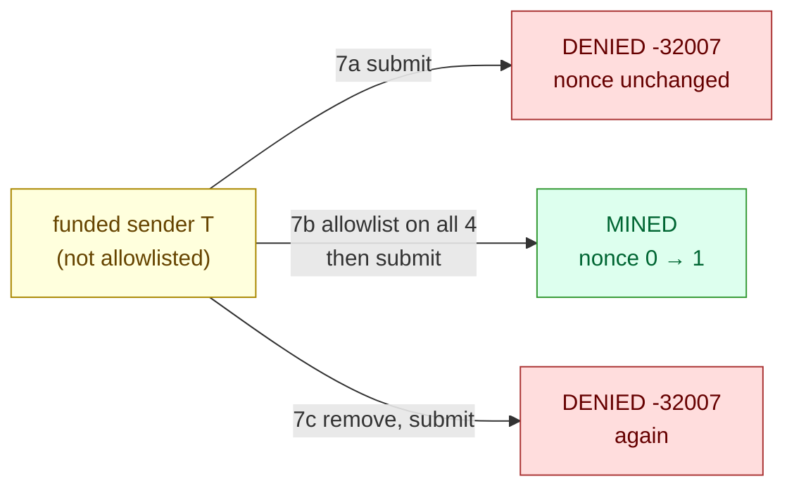

# Scenario 07 — Account Permissioning (transaction authorization)

The second transaction-layer scenario, and the companion to
[scenario 06](../06-txpool-flooding/). Together they pin down the **two gates** a
new consortium participant must clear before a transaction lands on-chain:

1. be **allowlisted** — this scenario, account permissioning; and
2. hold a **balance** — [scenario 06's zero-balance gate](../06-txpool-flooding/README.md#observed).

The two fail in **different shapes**, which is the whole point of separating them:
permissioning **rejects at submission** (`eth_sendRawTransaction` errors, the tx never
enters the pool, the nonce never moves), whereas the balance gate **accepts** the
transaction and then silently never mines it. This scenario runs the allowlist as
designed (deny → allow → deny a single sender); its failure-open counterpart — the same
allowlist emptied so *every* sender is locked out — is
[scenario 08](../08-permissioning-outage/).

**Consensus:** engine-agnostic — account permissioning gates transaction *senders*, not
the validator set; block production is untouched throughout.



## Hypothesis

With Besu **account permissioning** enabled, only allowlisted accounts may submit
transactions; a non-allowlisted sender is **rejected at submission** with an
authorization error — distinct from the balance gate, which accepts and then strands.
To isolate the authorization gate from the balance gate, the test account is
**genesis-funded** and simply **not on the allowlist** — so any denial is purely
permissioning, not lack of funds.

## Method

Account permissioning must be **enabled at node startup**, which the main `sbx` network
does not have (and must not — it would break scenario 06). So this scenario spins up
its **own** short-lived permissioned network in namespace `besu-perm` and tears it down
afterwards. Requires the besu-sandbox chart **≥ 0.2.1** (writable allowlist staging —
see [Chart note](#chart-note-why--021)).

1. **Install** `sbxperm` in `besu-perm` with `permissioning.accounts.enabled=true` and
   `allowlist={0x57f2…}` (a genesis-funded treasury account).
2. **7a — deny:** account `T = 0xe2e0…` (genesis-funded, **not** allowlisted) submits a
   tx → expect **rejected at submission**, nonce unchanged.
3. **7b — allow:** `perm_addAccountsToAllowlist([T])` on **every** validator (each node
   keeps its own permissioning state) → `T` submits → expect **mined**.
4. **7c — deny again:** `perm_removeAccountsFromAllowlist([T])` on every validator →
   `T` submits → expect **rejected** again.

```sh
make scenario-07                 # install → 7a/7b/7c → teardown
make scenario-07 KEEP_NETWORK=1  # keep the besu-perm network for inspection
```

Allowlist changes use the **in-memory** `perm_*` methods (immediate); the ConfigMap file
remains the source of truth across restarts.

## Expected

- A non-allowlisted (but funded) sender's transaction is **rejected at
  `eth_sendRawTransaction`** with an authorization error — it never enters the pool, so
  the nonce does not move (contrast: the zero-balance case is *accepted* and sits
  pending).
- After allowlisting on all validators, the same account's transaction mines.
- After removal, it is rejected again.
- Block production is unaffected throughout.

## Observed

Verified on chart **0.3.3** (Besu 26.6.1, kind on macOS/arm64, foundry `cast`,
QBFT, free gas) against a freshly-installed `sbxperm` network with
`allowlist=[0x57f2…]` (treasury):

| Step | Result |
| ---- | ------ |
| 7a · deny | `T` (funded **90000 ETH**, not allowlisted) → **`-32007: Sender account not authorized to send transactions`**, nonce unchanged |
| 7b · allow | `perm_addAccountsToAllowlist([T])` on all 4 → allowlist `[0x57f2…, 0xe2e0…]` → tx **MINED**, nonce **0 → 1** |
| 7c · deny | `perm_removeAccountsFromAllowlist([T])` on all 4 → **`-32007`** again, allowlist back to `[0x57f2…]` |

- **7a — denied at submission.** `T = 0xe2e0352c…` held **90000 ETH** but was not
  allowlisted; its 0-gas tx was **rejected immediately** by `eth_sendRawTransaction` with
  `-32007: Sender account not authorized to send transactions`, and its nonce stayed put
  (rejected at the RPC, never pooled). Because T is funded, the denial is purely
  **authorization** — cleanly isolated from the [balance
  gate](../06-txpool-flooding/README.md#observed).
- **7b — allowed.** `perm_addAccountsToAllowlist([T])` on **all four** validators made
  the allowlist `[0x57f2…, 0xe2e0…]`; T's tx then **mined** (nonce 0 → 1). The change is
  per-node, so it must be applied on every validator.
- **7c — denied again.** `perm_removeAccountsFromAllowlist([T])` on all four → T rejected
  again with the same `-32007`; allowlist back to `[0x57f2…]`.
- Block production was **unaffected** throughout — account permissioning gates
  transaction *senders*, not consensus.

The headline distinction from scenario 06: account permissioning is an **immediate
rejection at submission** (`-32007`, the tx never enters the pool, the nonce never
moves), whereas the zero-balance gate **accepts** the transaction and then silently never
mines it. Two different failure shapes for the two gates a new participant must clear
(allowlisted **and** funded).

## Chart note (why ≥ 0.2.1)

Besu's local permissioning **persists the allowlist file** (changes survive restart), so
it opens the file for *write* at startup. A Kubernetes ConfigMap mount is **read-only**,
so on chart 0.2.0 every validator crashed on startup with `Failed to start Besu: Error
reloading permissions file … "ERROR_ALLOWLIST_PERSIST_FAIL"`. Chart **0.2.1** fixed it by
staging the ConfigMap into a writable `emptyDir` via an initContainer. The diagnostic
lesson is reusable: go to the **container log of the crashing pod**
(`kubectl logs <pod> -c <besu-container>`) — the real error
(`ERROR_ALLOWLIST_PERSIST_FAIL`) names the cause precisely. (On 0.2.0 this surfaced as a
`helm --wait` timeout with pods `Ready: 0/1`; on chart 0.3.x `helm --wait` no longer gates
the validators — the StatefulSets are `OnDelete` — so the tell is crashlooping pods, not a
wait timeout.)

## Variations

- **Onchain permissioning (governed) — not available.** Besu's smart-contract
  permissioning was **removed in 25.6.0** (PR
  [besu#8597](https://github.com/hyperledger/besu/pull/8597)); file-based (this scenario)
  is the only built-in account permissioning on current Besu. Contract-governed
  authorization now belongs at the application layer.
- **Recipient permissioning.** Test whether the deployment also gates the transaction
  *recipient*, not just the sender.
- **Both gates at once.** A brand-new account that is neither funded nor allowlisted:
  show it is rejected by permissioning first, then (once allowlisted but still unfunded)
  accepted-but-pending by the balance gate, then mined once funded — the full onboarding
  sequence end to end.

## Runbook entries backed by this scenario

- [Transactions denied by account permissioning (not authorized to
  send)](../../runbook/07-account-not-authorized-to-send.md).
