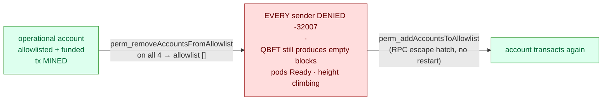

# Scenario 08 — Permissioning Outage (allowlist lockout)

The third transaction-layer scenario, and the dark twin of
[scenario 07](../07-account-permissioning/). There the allowlist works as designed —
deny → allow → deny a *single* sender. Here the same mechanism **fails open into a
network-wide lockout**: the allowlist loses the **operational** account and *every*
sender is rejected with `-32007`, while the chain keeps producing empty blocks and
looks perfectly healthy.

**Consensus:** engine-agnostic — permissioning gates transaction *senders*, not the
validator set; block production never pauses, which is exactly the trap.



## Hypothesis

On a permissioned network, the allowlist is a **single point of failure for the entire
transaction layer**. If the operational account is removed — a wrong admin change
("remove the departed member" hits the wrong address), or a cleared/empty allowlist from
a bad deploy — then **every** sender gets `-32007` and no user transaction can be
processed.

But — the trap — **QBFT keeps producing blocks** (empty ones) the whole time. Pods stay
`Ready`, height keeps climbing, consensus is healthy. An operator glancing at "is the
chain up?" sees green while the network is, in effect, **frozen for users**. This is the
permissioning-layer analogue of the
[quorum-loss false comfort](../01-validator-loss/#step-2--quorum-loss-chain-halts) — except
here it's the **authorization** layer, not consensus, that is down (and here the chain
keeps *advancing*, not halting, which makes it even easier to miss).

## Method

Self-contained: installs its own permissioned network (like
[scenario 07](../07-account-permissioning/)) and tears it down. Requires chart **≥ 0.2.1**.

1. **Install** `sbxperm` with `permissioning.accounts.enabled=true` and
   `allowlist={0x57f2…}` (a genesis-funded account = the operational account).
2. **Baseline** — the operational account submits a tx → **mined**; chain advancing.
3. **Inject** — `perm_removeAccountsFromAllowlist([op])` on **all** validators → the
   allowlist is now empty.
4. **Observe** — the same account now → **`-32007` denied**; *and* the chain is still
   advancing (empty blocks) — transaction layer frozen, consensus fine.
5. **Recover** — `perm_addAccountsToAllowlist([op])` on all validators → the account
   transacts again. No restart.

```sh
make scenario-08                 # install → baseline → outage → recover → teardown
make scenario-08 KEEP_NETWORK=1  # keep the besu-perm network for inspection
```

## Expected

- The operational account works at baseline, is **locked out** (`-32007`) after the
  allowlist removal, and works again after it is restored.
- **Block production never pauses** — the chain keeps producing empty blocks throughout
  the outage. That is the false-comfort signal.
- Recovery is immediate and needs **no restart** (the `perm_*` RPC methods are an escape
  hatch for file-based permissioning).

## Observed

Run against a freshly-installed `sbxperm` network on kind v0.32.0 (macOS/arm64,
kubectl 1.36.1, chart 0.3.1, Besu 26.6.0, QBFT, free gas):

- **Baseline** — the operational account `0x57f2…` (allowlisted + funded) submitted a tx
  → **mined**; `perm_getAccountsAllowlist` = `[0x57f2…]`; chain advancing.
- **Inject** — `perm_removeAccountsFromAllowlist([0x57f2…])` on all four validators →
  allowlist became **`[]`** (empty).
- **Outage** — the *same* account now → **`-32007: Sender account not authorized to send
  transactions`**. Simultaneously the chain **kept advancing** (height **5 → 6** during
  the check): QBFT produced empty blocks throughout. **Transaction layer frozen,
  consensus healthy** — pods `Ready`, height climbing, yet no user transaction can be
  processed. That is the false-comfort signal an "is-the-chain-up?" check misses entirely.
- **Recover** — `perm_addAccountsToAllowlist([0x57f2…])` on all four → allowlist back to
  `[0x57f2…]` → the account transacted again. **No restart.**

Key takeaways: (1) with permissioning on, the **allowlist is a single point of failure
for the whole transaction layer** — a one-line admin mistake freezes *every* user while
the chain looks perfectly healthy; (2) monitoring must watch **transaction admission /
`-32007` rates**, not just block height; (3) file-based permissioning has an **RPC escape
hatch** (`perm_*` recovers a total lockout with no restart). Besu's onchain permissioning,
which had no such escape hatch, was removed in 25.6.0 (PR
[besu#8597](https://github.com/hyperledger/besu/pull/8597)), so file-based is the only
built-in option.

## Recovery: escape hatch vs durable fix

This scenario recovers with the **`perm_*` RPC** on purpose — that is the finding worth
showing: a total lockout clears **instantly, on the running nodes, with no restart**.
There are two ways to change the allowlist, and on chart 0.3.x they behave differently
**by design**:

- **`perm_addAccountsToAllowlist` (RPC) — runtime, no restart.** Immediate, but
  **runtime state**: the live allowlist is a writable copy re-seeded from the ConfigMap at
  pod start, so the RPC fix is **lost on the next pod restart**. If the outage came from a
  bad ConfigMap (an empty allowlist deployed), a reschedule re-breaks it.
  (`perm_reloadPermissionsFromFile` re-reads that same staged copy, **not** the ConfigMap.)
- **`helm upgrade --set …allowlist=…` — durable baseline, restarts nothing.** The
  allowlist ConfigMap is **deliberately excluded from the chart's config checksums** (0.3.0+),
  precisely so allowlist edits don't bounce validators. The upgrade updates the restart
  baseline but **restarts nothing**; it takes effect on the next restart (or you make the
  live state match by also applying it via `perm_*`).

So the professional recovery is **`perm_*` first to stop the bleeding (no downtime), then
`helm upgrade` to update the durable ConfigMap baseline** — the same "runtime vs source of
truth" split as the validator-set votes in [scenario 04](../04-validator-governance/) and
account onboarding in [scenario 07](../07-account-permissioning/). The
[runbook](../../runbook/08-network-up-but-no-transactions.md) records both steps.

**Restarting validators (chart 0.3.x).** If you *do* restart — to re-stage the allowlist
from an updated ConfigMap, or for any startup-only setting — the validator StatefulSets use
`updateStrategy: OnDelete`, so **`kubectl rollout restart` does not work**; delete pods one
at a time instead (`kubectl delete pod <release>-validator<N>-0`, waiting for Ready + peer
mesh between each) to preserve BFT quorum. A config change made through `helm upgrade` that
touches the **checksummed** `config.toml` (e.g. toggling `permissioning.accounts.enabled`)
is rolled **automatically, one at a time**, by the chart's post-upgrade serialized-rollout
hook — no manual sequencing (give it `--timeout 15m`).

## Variations

- **Cleared allowlist in the ConfigMap** (vs runtime `perm_remove`): set an empty
  `permissioning.accounts.allowlist` via `helm upgrade`. On 0.3.x this restarts nothing
  (the allowlist ConfigMap is deliberately not checksummed), so it is **latent** — it
  bites on the **next validator restart**, when the staged file is re-seeded empty. The
  more insidious version precisely because it is the source-of-truth baseline: a restart
  *re-applies* it, whereas a runtime `perm_remove` is cleared by a restart.
- **Onchain lockout (historical — not buildable):** onchain permissioning would have been
  the dangerous cousin (lockout via an admin transaction that is itself blocked, no
  `perm_*` escape hatch), but Besu **removed onchain permissioning in 25.6.0**, so it
  can't be reproduced.
- **Partial lockout** — remove the account on only *some* validators: submissions routed
  to a still-permitting node are admitted but may be rejected at block import by a
  removed-on node, producing intermittent `-32007` (the per-node state pitfall from the
  [runbook](../../runbook/07-account-not-authorized-to-send.md)).

## Runbook entries backed by this scenario

- [Network "up" but no transactions accepted (permissioning
  lockout)](../../runbook/08-network-up-but-no-transactions.md).
