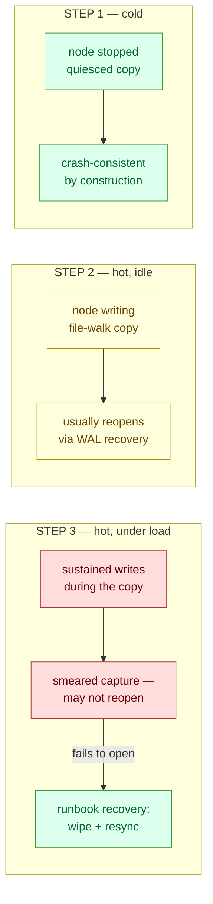

# Scenario 09 — Snapshot Restore (cold · hot · hot under load)

Every scenario so far broke the network's _present_: a validator killed
([01](../01-validator-loss/)), isolated ([02](../02-network-partition/)), degraded
([03](../03-slow-peer/)), or a transaction gated
([06](../06-txpool-flooding/)–[08](../08-permissioning-outage/)). This one tests its
_past_: the backup you will reach for when a node's volume is lost. Backups are the
canonical false comfort: they exist, they're scheduled, and nobody has ever restored
one. The question with real operational weight is not "do we have a snapshot?" but
"was it taken in a way that can actually be restored?", and the answer depends on _how_
it was taken, which is what the three steps separate.

**Consensus:** engine-independent (**QBFT · IBFT 2.0**). This is a storage-layer
scenario: one node's data volume, consensus never touched. The target validator
(default 4) is beyond quorum, so the chain keeps producing at 3-of-4 through every
stop/restore/restart cycle.



## Hypothesis

Three claims, in descending order of certainty:

1. A cold snapshot always restores. Stop the node first and the on-disk RocksDB is
   quiesced, so the copy is crash-consistent _by construction_ and must reopen with zero
   recovery and zero errors. This is the procedure to rely on; running it is also a
   restore drill that yields real RTO numbers instead of an untested assumption.
2. A hot copy of an idle database usually restores. RocksDB keeps a write-ahead log
   and is designed to recover a crash-consistent image. On a quiet chain (2s blocks,
   small DB) the copy typically completes between writes and reopens cleanly: a lower
   bound, not a guarantee.
3. A hot copy under write pressure is where the guarantee actually ends. A
   file-walk copy (`tar`, `rsync`, restic-style backup) of a live directory is not a
   point-in-time image; files are read at different instants, so the copy can capture an
   SST/MANIFEST combination that never existed on disk at any single moment. That is
   strictly worse than a crash, and it is the arm that can genuinely fail to reopen. If
   it does, the recovery is the runbook's wipe-and-resync, which the script executes, so
   the loop closes with a healthy node either way and records which path won.

### The storage stack, in one minute

What is actually inside that volume, bottom-up, the model the three claims rest on:

- **Besu** doesn't write data files itself; it delegates all persistence to an embedded
  storage engine. Backup safety is therefore a storage-engine question, not a Besu
  question.
- **Bonsai** is Besu's storage _format_: blockchain and a flat world state (plus trie
  logs for rollbacks) laid out as key-value data, all inside one database.
- **RocksDB** is that database. A write lands in two places at once: the memtable (an
  in-memory buffer) and the WAL (write-ahead log, an append-only file on disk). Only
  when the memtable fills does RocksDB flush it to an immutable SST file; the MANIFEST
  records which SSTs currently make up the database.
- **WAL recovery** is the crash-safety half of that design: after an unclean stop,
  whatever the memtable lost is replayed from the WAL on the next open, reconstructing
  the exact pre-crash state. Any _point-in-time_ image of the volume (a power-loss
  state, a block-level snapshot) is recoverable this way by construction.
- A **smeared copy** breaks the precondition, not the mechanism: pairing a MANIFEST from
  one instant with SSTs from another produces a file set that never existed at any single
  moment. There is nothing to replay out of, so RocksDB reports `Corruption` and refuses
  to open.

This model also explains STEP 3's outcome in advance: between flushes, writes accumulate
in the memtable and WAL while the SST files sit still, so a fast copy of a small database
is effectively atomic even under heavy transaction load. The smear window opens with
database _size_ and flush/compaction frequency, not transaction rate.

### Not the Quorum "freezer desync" — a defused fear

This scenario's ancestor (from production GoQuorum/Geth experience) was the freezer
desync: those clients split chain data between a live LevelDB/RocksDB and a separate
append-only _ancient store_, and a hot backup could capture the two halves in
inconsistent states, leaving a node that won't start. Besu has no freezer. On this
network the format is Bonsai (`DATABASE_METADATA.json` → `"format":"BONSAI"`): blockchain
and world state live in one RocksDB, copied and restored atomically as one unit, so the
two-store failure class is impossible by construction, not just unlikely. Operators
arriving from GoQuorum can retire that instinct; what remains is the narrower, purely
RocksDB question the three steps answer.

### Backup classes are not interchangeable

The word "snapshot" hides three very different consistency guarantees, the load-bearing
distinction of this scenario:

| Backup class                                                                 | Consistency                                      | Verdict                                                                                  |
| ---------------------------------------------------------------------------- | ------------------------------------------------ | ---------------------------------------------------------------------------------------- |
| **Cold copy** (node stopped)                                                 | Quiesced — perfect                               | Deterministic; the restore source to rely on (STEP 1)                                    |
| **Block-level point-in-time snapshot** (cloud volume / CSI `VolumeSnapshot`) | Crash-consistent — as if the power failed        | What RocksDB's WAL is _designed_ to recover; not injectable on kind (no CSI snapshotter) |
| **File-walk copy of a live directory** (`tar`, `rsync`, restic)              | _Smeared_ — files captured at different instants | Worse than a crash; the class injected in STEPs 2–3                                      |

The hot arms inject the _smear_ class, both because it is what `kubectl exec … tar` (and
every ad-hoc `rsync` backup job) actually is, and because it is the adversarial bound: a
smeared copy that reopens says little about the smear class in general (see STEP 3's
honesty note), but one that _fails_ marks exactly where "hot backups are fine" stops
being true. Cloud volume snapshots sit in a strictly safer class and should not be
lumped in with file-walk copies; the runbook entry keeps the classes separate.

## Method

The target's PVC (`data-<release>-validator4-0`) is operated on directly: a throwaway
helper pod mounts it while the node is scaled to 0, wipes the live DB, and extracts a
snapshot in its place, the way a real restore works. Snapshots are `tar`s of `/data`'s
`database` directory plus its metadata files, taken cold (helper pod, node stopped) or
hot (`kubectl exec` in the running Besu container, `--warning=no-file-changed`, exit
code recorded, since GNU tar exits 1 if a file changed while being read: a confirmed
mid-write capture).

- **STEP 1** — cold restore. Scale to 0 (RocksDB quiesced), snapshot, hold `DOWN_WINDOW`
  (default 20s) so a catch-up gap builds, restore, restart. Held to a hard standard: any
  DB-error line or failed open fails the scenario, since a quiesced copy has no excuse.
- **STEP 2** — hot restore, idle. Snapshot inside the running node (no induced load),
  restore, restart. Expected to reopen via WAL recovery.
- **STEP 3** — hot restore under load. A caster pod (foundry, as in
  [scenario 06](../06-txpool-flooding/)) drives sequential-nonce transfers from the
  genesis-funded dev account so every block mines state-changing transactions, then
  `HOT_TARS` (default 3) hot copies are taken back-to-back during the load. The copy tar
  flagged as changed-while-read is restored if there is one (the confirmed smear);
  otherwise the last. If the restored DB fails to open within `READY_TIMEOUT`, the
  failure is logged as the finding and the runbook recovery (wipe the volume, resync from
  peers) is executed and asserted.

```sh
make scenario-09            # STEPs 1, 2, 3 (default)
make scenario-09 STEP=1     # cold only — the backup-procedure drill
make scenario-09 STEP=3     # hot-under-load only
make scenario-09 TARGET_VALIDATOR=2 HOT_TARS=5
```

Safety net: the cleanup trap always scales the target back to 1 and removes the
helper/caster/probe pods. The volume then holds the old DB, a restored copy, or a wiped
directory; Besu starts (or cleanly resyncs) from any of those. Only a run killed
_mid-extract_ can leave a half-written DB, which is precisely the runbook's
wipe-and-resync case.

## Expected

- **Baseline / throughout:** the chain never pauses; the target is beyond quorum, and
  every scale-down is asserted against `assert_chain_advancing`.
- **STEP 1:** clean reopen, 0 DB-error lines, catch-up to within `CATCHUP_GAP`
  (default 10) of head. Deterministic.
- **STEP 2:** reopen via WAL recovery (possibly one startup restart), then catch-up. tar
  exit 0 is likely on a quiet 2s-block chain (the copy finishes between writes).
- **STEP 3:** at least one tar exit 1 under load (a confirmed mid-write capture), then
  _either_ outcome is a result: a clean reopen stresses WAL recovery against a genuine
  smear and passes; a failed open is the money finding and exercises the wipe-and-resync
  recovery end-to-end. If all tars exit 0 even under load, the run says so; it then
  bounds only the quiet case and does not claim more.

## Observed

Verified on chart 0.3.3 (Besu 26.6.1, kind on macOS/arm64, 2s block period, Bonsai,
metadata `"v2": {"format":"BONSAI","version":3}`, QBFT), restoring validator4. All three
steps ran in one session; the chain kept producing at 3-of-4 through every
stop/restore/restart cycle and returned to a full `3/3/3/3` mesh at a common height after
each.

| Step                | tar exit(s)  | startup restarts | DB-error lines | Ready after restart | catch-up gap      |
| ------------------- | ------------ | ---------------- | -------------- | ------------------- | ----------------- |
| 1 · cold            | — (quiesced) | 0                | **0**          | **21s**             | **0** (6965/6965) |
| 2 · hot, idle       | 0            | 0                | 0              | **21s**             | **0** (6975/6975) |
| 3 · hot, under load | 0, 0, 0      | 0                | 0              | **22s**             | **0** (6993/6993) |

- **STEP 1** — cold. Snapshot at height 6943 with the node stopped; restored over the
  wiped volume and restarted, with a clean open, `Ready` in 21s, 0 DB-error lines, caught
  up to gap 0.
- **STEP 2** — hot, idle. tar exit 0 at height 6965 (no mid-write capture, the copy
  completes between 2s-block writes), then `Ready` 21s after restart with 0 startup
  restarts and 0 DB-error lines, gap 0.
- **STEP 3** — hot, under load. The caster streamed sequential-nonce transfers and the
  load was real: an independent sampling of the mined blocks during a load window counted
  up to 126 transactions per block (`eth_getBlockTransactionCountByNumber`). All three
  back-to-back hot tars still exited 0 (none was caught mid-write), and the restored copy
  reopened with 0 restarts, 0 DB-error lines, gap 0.

The expected smear did not materialise, and that null result is the finding. On a
database this small the tar completes in milliseconds, and RocksDB absorbs writes in its
WAL/memtable between SST flushes, so the file set the copy walks is effectively static
even at 100+ tx/block. The window for a smeared capture scales with database size and
flush/compaction frequency, not transaction rate alone. This run bounds the small-DB
case: the mid-write failure remains unreproduced, and the cold-vs-hot guidance rests on
consistency classes, not on an observed failure. Reproducing an actual failed open needs
a database large enough that the copy overlaps compactions (see Variations).

## Variations

- An aged database. Run against a chain whose Bonsai DB has grown to hundreds of MB+
  (a long-lived network, or synthetic state growth), where the copy takes long enough to
  overlap SST flushes and compactions, the regime where a smeared hot capture becomes
  realistic and the failed-open path can be observed rather than reasoned about.
- Restore onto a different node identity (validator4's DB under a fresh member node)
  to separate "the DB reopens" from node-key/enode identity concerns.
- Restore a much older snapshot to measure catch-up rate, the input an RTO estimate
  for backup-based rebuilds actually needs.
- A real block-level snapshot: on a cluster with a CSI snapshotter (or a cloud volume
  snapshot), restore from a `VolumeSnapshot` instead of a tar, the crash-consistent class
  the smear arms deliberately under-approximate.

## Runbook entries backed by this scenario

- [Restoring a node from a volume snapshot](../../runbook/09-node-restore-from-volume-snapshot.md)
